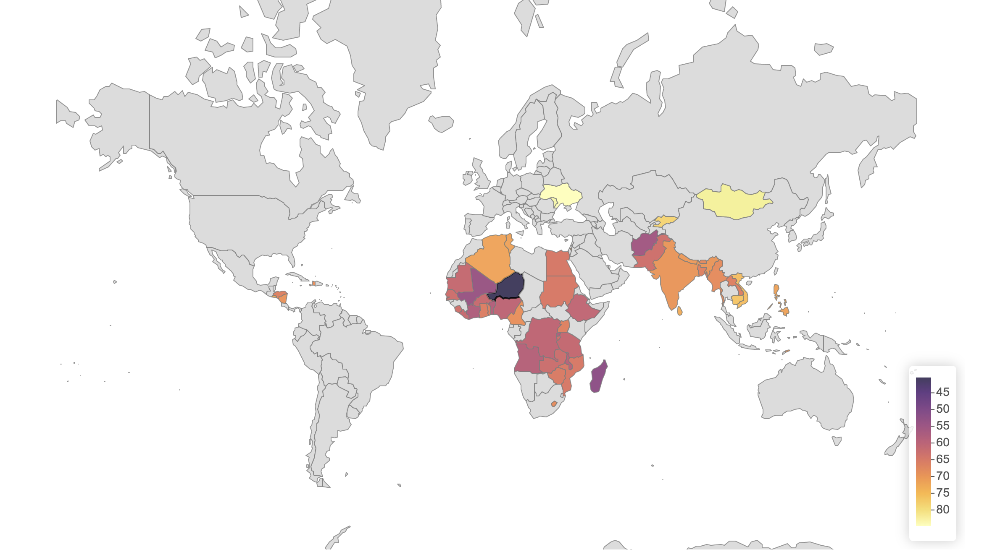
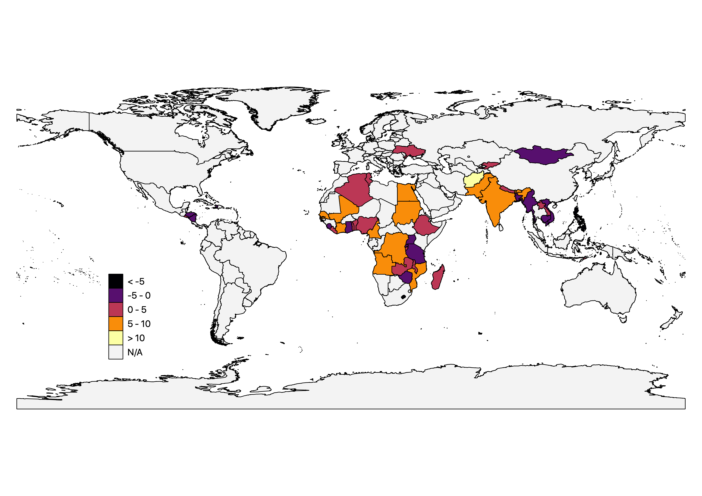

```{r index_setup, include=FALSE}
packages <- c("openxlsx", "tinytex", "bookdown", "gtsummary", "xtable", "stargazer", "data.table", "gridExtra", "fmsb", "grid", "ggrepel", "ggcorrplot", "tidyverse", "lamadex", "flextable", "kableExtra")

options(repos = c(CRAN = "http://cran.rstudio.com"))

# load the lamadex
devtools::install_github("bkudrzycki/youth-lmi/lamadex", quiet = TRUE, upgrade = "always")

# install packages not yet installed
installed_packages <- packages %in% rownames(installed.packages())
if (any(installed_packages == FALSE)) {
  install.packages(packages[!installed_packages], silent = TRUE)
}

# load packages
invisible(lapply(packages, library, character.only = TRUE))

rm(installed_packages)

# load code chunks
knitr::read_chunk('../code/index_tables.R')
knitr::read_chunk('../code/index_figures.R')

# set knitr and flextable options
set_flextable_defaults(font.family = 'Palatino',
                       theme_fun = "theme_apa")

knitr::opts_chunk$set(message=FALSE,
                      warning=FALSE,
                      echo = FALSE,
                      cache = TRUE,
                      fig.path='figures/',
                      fig.pos = 'H', 
                      out.extra = "",
                      floatfoot.envs = c("figure", "table", "longtabu"))

options(scipen=2, digits=2)
```

```{r load_data, include=FALSE}

# generate YLILI ranks
rank <- lamadex::rank_generator(bygender = "Total", countries = "dev", years = c(2010, 2020), impute = TRUE) %>% arrange(desc(index_mean))
male <- rank_generator(bygender = "Male", years = c(2010, 2020), impute = TRUE) %>% arrange(desc(index_mean))
female <- rank_generator(bygender = "Female", years = c(2010, 2020), impute = TRUE) %>% arrange(desc(index_mean))

# load lists of countries and regions
all_countries <- countryLists()[[9]] %>% 
  mutate(inc_level = ifelse(ref_area.label %in% c(countryLists()[[1]]$ref_area.label, countryLists()[[2]]$ref_area.label), "LIC/LMIC", "HIC/UMIC"))

regions <- read.csv("../data/country_regions.csv") %>% 
  dplyr::select("country" = "Country.or.Area",
                "Region" = "Region.Name",
                "Sub-region Name" = "Sub.region.Name",
                "Intermediate Region Name" = "Intermediate.Region.Name")

regions$`Sub-region Name` <- regions$`Sub-region Name` %>% #fix country names to match ILOSTAT for joining
  recode("Latin America and the Caribbean" = "Latin America")

regions$country <- regions$country %>% #fix country names to match ILOSTAT for joining
  recode("Democratic Republic of the Congo" = "Congo, Democratic Republic of the",
         "Republic of Moldova" = "Moldova, Republic of",
         "United Republic of Tanzania" = "Tanzania, United Republic of",
         "State of Palestine" = "Occupied Palestinian Territory",
         "Côte d’Ivoire" = "Côte d'Ivoire",
         "Bolivia (Plurinational State of)" = "Bolivia",
         "Cabo Verde" = "Cape Verde",
         "Micronesia (Federated States of)" = "Micronesia, Federated States of",
         "Democratic People's Republic of Korea" = "Korea, Democratic People's Republic of")
```

# Introduction

Over the past three decades, the global share of youth residing in developing countries has increased by 20 percentage points, to a little over 50 percent of all youth in 2020 [@unitednationsdevelopmentprogramme2019]. This share is expected to continue to rise, and with it the number of young workers entering the workforce [@roser2019]. Lacking formal employment opportunities and facing unemployment without social security, youth in many low-income countries (LICs, as classified by the @worldbank2020a) and lower-middle income countries (LMICs) must resort to work that is irregular, underpaid, and lacking in benefits or advancement opportunities. Few can afford to be inactive for extended periods of job search after leaving school. In sub-Saharan Africa (SSA), where 40 percent of inhabitants are under the age of 15 and where youth population growth is outpacing formal job creation by a large margin, the "youth employment crisis" is increasingly also being seen as a "missing jobs" crisis [@sumberg2021]. Long unemployment spells reduce productive capacity in later life, curtailing youths' earnings potential and dampening the growth prospects of the economy [@gregg2005]. In the worst case, persistent difficulties in transitioning to gainful work can drive youth to political unrest and violence, as has been the case in the Middle East [@urdal2006].

The UN has addressed this issue with its 8th Sustainable Development Goal (SDG)---full and productive employment and decent work for all, with particular emphasis on youth (and other vulnerable populations). Unfortunately, the productivity and decency of work does not lend itself to easy measurement. The unemployment rate is the most widely-used indicator for evaluating labor market strength, but it is largely uninformative in many developing countries, where low savings rates and the lack of social insurance force youth to accept underpaid, unskilled work. In such an environment, rather than indicating widespread "decent" work, low unemployment rates reflect that large segments of the youth population simply cannot afford _not_ to work [@zimmermann2013; @dewan2007]. Thus, to better analyze and compare youth labor markets in developing countries, a more multifaceted indicator than the unemployment rate is needed. 

To this end, this paper presents the Youth Labor Index for Lower-Income Countries (YLILI)---a composite index of 10 youth labor market indicators specifically tailored to the realities of work in low- and lower-middle income countries and organized around three central themes: youth transition to work, working conditions for youth, and human capital. The YLILI builds on a related index compiled by the Swiss Economic Institute (KOF), but relies on indicators that are more relevant to and available for low-income countries. Specifically, the unemployment rate is replaced by indicators more appropriate for the measurement of highly informal economies.

A measure of youth labor market strength will ideally be youth-specific rather than pertaining to the working-age population as a whole. Youth and adults face qualitatively different conditions and obstacles on the labor market. For one, youth often experience worse outcomes than adults: according to the latest ILO statistics for LICs and LMICs, for instance, they were 20 percent (3.2 percentage points) more likely to be among the working poor and 13 percent more likely to be underemployed [@ilo2020b]. Rapid demographic and structural change also imply generational differences in the nature of work: youth face stiffer competition due to growing populations, are more likely to migrate to urban areas [@debrauw2014], and are increasingly eschewing the agricultural work of their parents and grandparents [@honorati2016]. All indicators used in the YLILI are thus disaggregated by age group, covering youth aged 15--24 specifically, and include youth-specific measures such as school test performance. Disaggregation by gender allows for further analysis. Current data availability allows us to generate an overall YLILI score for 54 (out of 79) low- and lower-middle income countries. An accompanying online tool ([https://nadel.shinyapps.io/ylili/](https://nadel.shinyapps.io/ylili/)) allows users to view each index component in detail and compile the ranking according to custom parameters.

The YLILI suggests that, among low-income and lower-middle income countries, youth labor markets perform best in Europe and Central Asia. Meanwhile, 18 of the 20 worst-performing countries are located in SSA (Pakistan and Afghanistan being the two exceptions). The poor performance in SSA is driven primarily by high working poverty rates and low scores on measures of education. In general, education outcomes are found to vary the most across countries, and as such are the main driver of the final index rankings. Perhaps our most striking finding is that demographic patterns best predict the YLILI scores: countries with large youth populations and high fertility rates tend to perform worse on the YLILI index, particularly in the transition and education dimensions. This suggests a compounding of unfavorable demographic and labor market conditions for youth, with the highest numbers of youth entering labor markets with scarce opportunities. Thus, we conclude that prospects for youth in the poorest countries are unlikely to improve until fertility and dependency rates fall substantially. Finally, we examine differences in YLILI scores for young men and women and find that high female inactivity rates and substantial education deficits drive the observed gender gap, particularly in countries that perform poorly on the YLILI overall.

The remainder of the paper is structured as follows. Section \@ref(indicators) describes the indicators of the YLILI and the data. Section \@ref(methods) describes how the indicators are combined to generate the YLILI country score. Section \@ref(ylili_results) presents some applications of the YLILI, including regional analysis and a breakdown by gender. Section \@ref(robustness) presents several robustness checks, and highlights potential limitations. Section \@ref(discussion) concludes and discusses some policy implications.

# The YLILI Indicators {#indicators}

Composite indices help make complex and multidimensional phenomena more tractable by combining multiple measures into country-specific _ranks_ or _progress indicators_, which in turn allow for easier comparisons across countries and over time. Thanks to their simplicity, they are often instrumental in rallying attention to an issue in policy or governance, such as corruption (the Corruption Perceptions Index), human well-being (Human Development Index, HDI) or the business environment (Ease of Doing Business Index). In some cases, indices are also used to bring attention to the misuse of a popular indicator in public discourse. In the case of the HDI, a combination of life expectancy, education and income indicators was proposed as an alternative to GDP as a measure of a country's level of development [@undp1990].

The YLILI is inspired by the Youth Labor Market Index (YLMI), a composite index introduced in 2014 by the Swiss Economic Institute (KOF) and updated annually every year since [@renold2014]. The YLMI is composed of 12 indicators and has helped highlight issues such as the _youth paradox_---unprecedented educational attainment going hand-in-hand with rising youth unemployment in many high-income countries. However, the YLMI's heavy sourcing of data from the EU and OECD means its usefulness is limited to the study of youth labor markets in high-income countries [@pusterla2015; @pusterla2016]. Crucially, the index relies heavily on the unemployment rate, a widely-cited indicator that is much more informative in high-income than low-income contexts. Unemployment rates in the poorest countries regularly fall under 5 percent, but rather than indicating well-functioning labor markets, they remain low because social security systems are weak and informal, and most people simply cannot afford to remain idle [@filmer2014]. Families with low savings are unable to support graduates through an extended job search, leaving young people with no choice but to enter own-account employment or poorly-paid jobs below their skill level [@fields2012, margolis2014], predominantly in the informal sector [@herrera2013; @sengenberger2011].

Economic development tends to go hand in hand with the formalization of work [@laporta2014]---about 90 percent of employed youth in developing countries work in the informal sector on average, compared to less than 20 percent in high-income countries [@bonnet2018]. Formal work comes with many benefits, from higher wages to employment stability and social security coverage. Thus, the fact that among LICs and LMICs, _lower_ unemployment rates tend to be associated with _higher_ rates of informal work---in contrast to rich countries---presents a problem for the unemployment rate as a measure of economic health (Figure \@ref(fig:fig-infunemp). An indicator that can mean opposite things depending on development level violates a key assumption of composite indices, namely that each of the constituent indicators provides a well-ordered ranking of performance. For this reason, we exclude the unemployment rate from the YLILI.

```{r, fig-infunemp, fig.cap="Relationship between youth unemployment and informality by income level", fig.height=4, fig.width=8, fig.pos='H'}
```

In addition to the unemployment rate, the relaxed unemployment rate (the share of unemployed and discouraged workers relative to the size of the labor force), the relative unemployment rate (ratio of youth to adult unemployed) and the long-term unemployment rate (share of unemployed who have been continuously unemployed for a year or more) are all included in the KOF YLMI and pertain directly to the unemployment rate. We exclude these indicators from the YLILI as well, and replace them with measures that are more relevant for describing labor market conditions in low-income economies. For instance, the working poverty rate (living on less than \$1.90 a day) and the literacy rate are generally close to zero for high-income countries (and thus not part of the YLMI), but vary meaningfully for low-income countries. Table \@ref(tab:tbl-kofcomp) in the online Appendix provides a more detailed overview of the similarities and differences between the YLMI and YLILI. 

We stipulate four conditions that an indicator must fulfill to be included in the YLILI. First, the indicator must be a monotonic increasing function of labor market performance. This means that it must be clear whether a higher value of an indicator is always preferred to a lower one (i.e., the higher, the better) or vice-versa. From the perspective of a policy-maker, it must be possible to rank the indicator from the worst to the best outcome. Second, the indicator must be disaggregated by different age groups, and specifically must be available for the 15 to 24 age group. Third, the indicator must be desegregated by sex. Fourth, indicator estimates must be available for at least half of the LMICs and LICs dating back no further than 2010. We limit ourselves to indicators from four reputable compilers of international statistics: ILOSTAT, UNESCO, the World Bank, and the Demographic and Health Surveys (DHS). We retain indicators for which data is available for at least one year since 2010 for 40 or more low-income and lower-middle income countries (as of April 1st 2021, there were 79 LMICs and LICs combined according to the  @worldbank2020a).

Ultimately, we identified ten indicators that meet these conditions. We classified these into three broad dimensions that best reflect, in our view, youth labor markets in developing countries: transition from education to the labor market, working conditions, and educational background (Table \@ref(tab:tbl-indicators)). On the demand side, the transition dimension reflects economic participation and the smoothness of the transition from education to the workplace, whereas the working conditions dimension captures the quality of work. The final dimension (education) focuses on the supply side of the labor market, i.e., the skill level of job seekers. Ultimately, indicators were chosen as much based on data availability as desirability; nevertheless, it is worth noting that as with any composite index, the final choice and weighting of indicators is a value-laden interpretation of the authors. A corresponding webtool ([https://nadel.shinyapps.io/ylili/](https://nadel.shinyapps.io/ylili/)) allows users to fine-tune the index to their preference and to test the robustness of the final rankings presented here. For more details on the availability of each indicator, see Section \@ref(availability) in the online Appendix.

\begin{singlespacing}
\input{tables/indicators.tex}
\end{singlespacing}

## Transition from Education to the Labor Market

The transition category captures quantity adjustments of youth labor in developing countries. The share of youth Neither in Employment nor in Education or Training (NEET) captures the level of inactivity in the youth population, while the youth skills mismatch characterizes the degree to which the supply of youth skills meets employer demand. The relative working conditions ratio is an adaptation of the relative unemployment ratio, and compares labor market outcomes of youth to those of older workers without relying on unemployment rates.

The __share of youth NEET__ captures the percentage of people aged between 15 and 24 years old who are neither in employment nor in education and training (data obtained from ILOSTAT). Hence, it refers to individuals fulfilling two mutually inclusive conditions: (i) they are not employed (i.e., are unemployed, discouraged, or inactive), and (ii) have not received any education or training in the four weeks preceding the survey [@elder2015a]. Young people in education include those attending full-time or part-time education, but exclude those in non-formal education and in educational activities of very short duration [@oecd2019]. Both formally and informally employed youth are considered to be working, and are thus not counted among NEET youth. Average NEET rates are given in Table \@ref(tab:tbl-indicators) and shown graphically in Figure \@ref(fig:fig-transitionmap) in the online Appendix. The NEET rate does not track national income in a linear manner: about 28 percent of youth in lower-middle income countries are NEET, while this rate is closer to 20 percent in both upper-middle and low income countries. High income countries have much lower youth inactivity rates, with just 11 percent youth NEET on average.

The __relative working conditions ratio__ pertains to the difference in two aspects of work quality between youth and adults (aged 25+ years old): the working poverty rate and the time-related underemployment rate. The working poverty rate is expressed as the percentage of workers living below US\$1.90 PPP. The time-related underemployment rate captures the proportion of working youth who are able and willing to increase their working hours and who are working under a threshold number of hours for a reference period. This threshold is determined separately by each country based on national circumstances.

The relative working conditions ratio indicator measures the degree to which working conditions differ for youth and adult workers, and thus captures whether youth enjoy labor conditions that are "typical" for their country. Youth suffering from substantially lower working conditions than the adult working population would suggest that youth engage in different jobs or tasks than adults and indicate a slower transition to decent work. We self-compute it using data from ILOSTAT as follows: 

\footnotesize
$$ \text{Relative WC ratio}= \frac{\displaystyle{\frac{\text{Youth work. poverty rate}}{\text{Adult work. poverty rate (25+)}}} + \displaystyle{\frac{\text{Youth time-related unmp. rate}}{\text{Adult time-related unmp. rate (25+)}}}}{2} $$
\normalsize
\vspace*{5pt}

The closer the youth and adult rates, the more the ratio tends to one, suggesting equality in working conditions between youths and adults. Taken separately, the two components of this indicator (working poverty and the underemployment rates) tend to unity in the ideal case: when youth and adult conditions are similar. Jointly, the indicator needs to be interpreted cautiously, as a ratio above one (favoring adults) can be counterbalanced by a ratio below one (favoring youth), creating the impression of equality between generations where there is none. Youth in developing countries are about 20 percent more likely to belong to the working poor than adults, and about 13 percent more likely to face time-related underemployment. Working poverty and underemployment are higher in LICs and LMICs than higher income countries, while the differences (ratios) between youth and adult outcomes tend to be lower in relative terms.

__Job mismatch__ is the third and final indicator in the transition dimension and refers to the difference between a worker's skill level and the level required by their employer. It accounts for two situations: (i) workers who are constrained to accept jobs for which they are overqualified or that do not match their skills/training and (ii) workers who hold jobs for which they are not qualified. Since the mid-1990s and the advent of the United Nation's Millennium Development Goals at the beginning of the 21st century, grass-roots approaches to solving poverty have mainly focused on improving the supply side of the labor market, i.e., making job-seekers more educated and skilled, and not the demand side, i.e. making new and/or better jobs available [@amsden2010; @gore2010]. As a result, large numbers of over-qualified workers unable to take full advantage of their skills are common in many LMICs and LICs [@handel2016].

There are several ways to measure mismatch. One is to calculate the difference between the highest level of education attained and the dominant level of education observed for the worker's occupation [@herrera2013]. Unfortunately, such an indicator is not available and cannot be computed using aggregated data. Our solution is to mirror the skills mismatch indicator used in the KOF YLMI, which utilizes the unemployment rate at different levels of education. This indicator captures the extent to which workers with a certain level of education are more or less affected by unemployment than others. Because this indicator is unavailable as such, we compute it manually using unemployment data disaggregated by age and level of education from ILOSTAT as follows: 

\footnotesize
$$\text{Skills mismatch rate}= \frac{1}{2} \sum_{k=1}^4 \Bigl| \Bigl(\frac{\text{Youth emp. with edu.} \ k}{\text{Total youth emp.}}- \frac{\text{Youth unemp. with edu.} \ k}{\text{Total youth unemp.}}\Bigl)\Bigl|$$
\normalsize
\vspace*{5pt}

where $k$ is the highest level of education completed (less than basic; basic; intermediate; advanced) and thus the higher the mismatch, the higher the rate. One shortcoming is that, since workers often have no choice but to take any job available, educational attainment can become undervalued in a saturated labor market. As a result, unemployment becomes less contingent on one's level of education, and can lead to an underestimated measurement of skill mismatch. With this caveat in mind, the youth skills mismatch rate averages just 12\% globally (Table \@ref(tab:tbl-indicators) and Figure \@ref(fig:fig-workcondmap) in the online Appendix) and rarely exceeds 20\% in developing countries using this definition.

## Working Conditions

The working conditions category aims to measure the quality and decency of employment, as promoted by SDG \# 8: full and productive employment and decent work for all. We attempt to capture whether the jobs performed by youth are sufficient to keep them out of abject poverty and generate a safe and stable livelihood. We rely on four indicators of working conditions: the proportion of youth working in poverty, the youth time-related underemployment rate, the share of youth in informal employment, and the share of youth working in elementary occupations. The vulnerable employment rate is also available for LICS and LMICs, but is conceptually similar to the informality rate, leading to concerns of double-counting youth and skewing the index. Moreover, it correlates closely with a number of other indicators in the index, including the informality rate, suggesting that little information is lost when we exclude it.

The __youth working poverty rate__ measures the proportion of youth working below the international poverty line set at \$1.90 PPP a day, i.e., measures the proportion of working youths living in "extreme" poverty (data obtained from ILOSTAT). The first shortcoming of this indicator is that it is estimated from household surveys and thus fails to account for intra-household distribution of resources; we have to assume that resources are equally distributed between members of the household. A second concern is that it splits the population into poor and non-poor, implying a substantial change in living conditions at the cutoff and neglecting important features of the income distribution (e.g., the distance of the poorest youth from the \$1.90 line). Finally, since raw data for this indicator is not currently available, we rely instead on modelled estimates generated by the ILO for country-year pairs for which country-reported data is unavailable. Thus, measurement error may bias this particular indicator. We are also aware that because this indicator is based on the monetary value of a person's consumption expenditures or income, it remains silent about other dimensions of poverty [@ophi2015]. Multidimensional measures of poverty, such as the Multidimensional Poverty Index [@alkire2011] aim to address this shortcoming, though aggregate data on youth working in multidimensional poverty is currently unavailable and, in most cases, income poverty is highly correlated with measured multidimensional poverty for the adult population. According to the most recent estimates from the ILO, about 12 percent of working youth globally live in extreme poverty, though they are unsurprisingly concentrated in low-income settings: 39 percent of Africa's working youth and 41.7 percent of working youth in low-income countries live below \$1.90 a day. Wide variations exist between countries, as shown in Figure \@ref(fig:fig-workcondmap) in the online Appendix.

The __youth time-related underemployment rate__ measures the share of youths employed who (i) are willing to work additional hours, (ii) are available to work additional hours, and (iii) worked less than a specified time threshold (combining all jobs), thus capturing the share of working youth whose productive capacity is underutilized (data obtained from ILOSTAT). The average youth-time related underemployment rate across all developing countries is about 10 percent (see Table \@ref(tab:tbl-indicators) and Figure \@ref(fig:fig-workcondmap) in the online Appendix).

The __share of youth in informal employment__ is the third indicator in the working conditions dimensions and is measured as a proportion of all working youth. According to the ILO, whether a job is categorized as informal depends on the status in employment of the worker. For own-account workers and employers, the formality of employment is determined by the formal or informal nature of their enterprise. For the employed, the formality of employment is defined by the employment relationship of employees to their employer: informal work is not subject to national labor legislation or income taxation or entitled to social protection or certain employment benefits, in law or in practice (data retrieved from @bonnet2018). Youth aged 15--24 are subject to the highest rates of informal work in every region of the world except Europe and Central Asia [@bonnet2018]. About 96 percent of working youth in SSA and Southern Asia work in informal jobs, per the @ilo2020. Even in Latin America, where the rate of formal wage employment is growing faster than the size of the working population, 55 percent of employed youth still work in the informal sector, leaving them particularly vulnerable to the frequent economic crises that continue to buffer the continent [@ilo2015]. As informality is associated with wage instability and precarious working conditions, this indicator is a vivid expression of the youth employment problem in developing countries.

Finally, the __share of youth working in elementary occupations__ is based on the definition of the ILO's International Standard Classification of Occupations 2008 (ISCO-08). Elementary occupations include cleaners and helpers, agricultural, forestry and fishery laborers, laborers in mining, construction, manufacturing and transport, food preparation assistants, street and related sales and services workers, refuse workers. These jobs usually involve low-skilled, physical tasks which may entail high risk of injury. We self-compute this indicator by obtaining employment data disaggregated by age and occupation from ILOSTAT. About 1 out of 5 workers is employed in an elementary occupation across developing countries (Table \@ref(tab:tbl-indicators) and Figure \@ref(fig:fig-workcondmap) in the online Appendix).

## Education

This final dimension focuses on the supply side of the labor market, i.e., education and skills acquired by job seekers. The skills required by employers depend greatly on the structural composition and stage of development of the economy in question. To ensure comparability for a global index, we thus focus on the most fundamental skills required for gainful employment: basic literacy and the duration and quality of education.  To measure the quantity of education, we employ the proportion of youth with no secondary education. To capture if youths have acquired the most basic skills relevant for employment, we use the youth illiteracy rate and a novel set of harmonized test scores.

We self-compute the __share of youth without secondary education__ using data from the Demographic and Health Surveys (DHS) Program. The DHS data classifies individuals according to their highest attained level of education in one of the following 6 categories: (i) no education, (ii) some primary education, (iii) completed primary education, (iv) some secondary education, (v) completed secondary education, (vi) more than secondary education. We define no secondary education as the sum of the first 3 categories (share with no education, share with some primary education, and share with completed primary education). For simplicity, we assume that the share of female and male youth in every country is equal at any time $t$: the sex ratio of youth aged 15-24 is close to 1 for nearly all developing countries [@cia2016]. We drop observations for which only female or only male data is available. Despite widespread efforts to increase school enrollment over the past three decades, about 45 percent of youth have still never pursued any secondary education (Table \@ref(tab:tbl-indicators)). Figure \@ref(fig:fig-educationmap) in the online Appendix reveals that this is still a considerable issue in SSA, where more than 60 percent of young people have never attended a single year of secondary education (e.g., Ethiopia, Mali, Malawi, etc.).

The __youth illiteracy rate__ measures the percentage of youth who are declared illiterate. It gives the most simple and straightforward indication on the overall minimum level of measurable skills attained by job seekers (data obtained from UNESCO). About one out of every five youths in developing countries is illiterate. Figure \@ref(fig:fig-educationmap) in the online Appendix indicates that youth illiteracy rates are low globally, and that only a handful of countries still have rates above 40\% (mainly located in Western Africa).

Finally, we include a set of __harmonized test scores__ recently compiled by the World Bank to measure the quality of primary and secondary education. For decades, the literature exploring the impact of education on economic development has used years of schooling as a measure of human capital [e.g. @barro1991; @mankiw1992, among others]. Using years of schooling as a proxy for human capital can be problematic, however, in that it assumes that school enrollment or attendance automatically translates into learning. This is often not the case, particularly in low-income countries [@worldbank2018]. To address this shortcoming, we exploit so-called _harmonized test scores_, one of the 3 components of the World Bank's new human capital index [@angrist2019; @kraay2018]. Harmonized test scores are computed from major international literacy and numeracy testing programs at the primary and secondary education levels. Evidence suggests that individuals with such basic skills have a higher likelihood of success in the labor market and that their skill remains highly valued worldwide [@vignoles2020]. Harmonized test scores are measured on the TIMMS (Trends in International Maths and Science Study) scale, where 300 is lowest possible score and 625 is the highest. Harmonized test scores are low in developing countries, With a mean of 380 compared to 452 in HICs/UMICs. Figure \@ref(fig:fig-educationmap) in the online Appendix shows that harmonized test scores are particularly low in SSA, where only four countries---Kenya, Gabon, Seychelles, Mauritius---outperform the HIC/UMIC mean.

# Index Construction {#methods}

The basic paradigm for composite indices is to rescale indicators to ensure comparability before grouping them into "dimensions", which are then used for final aggregation. The YLILI is scaled to vary between 0 (dysfunctional labor market) and 100 (well-functioning labor market). The YLILI keeps rescaling to a minimum to ensure ease of interpretation. Eight out of the 10 indicators used are already rates, allowing us to retain raw scores without any normalization. For the two indicators that are not rates---the relative working conditions ratio and the harmonized test scores---the Min-Max normalization method is used, in line with several well-known composite indices such as the Human Development Index or the Global Competitiveness Index 4.0 [@decancq2013; @oecd2008]. The working conditions ratio is given upper and lower bounds of 10 and 1 respectively, while the harmonized test scores are given a higher and lower bound equal to their natural scale of 300 and 625 (see section \@ref(weights) in the Appendix for more details). 

The 10 indicator scores, all on a scale of 0 to 100, are first combined into three dimension scores, which are then likewise combined to produce an aggregate index score. We use the arithmetic mean to calculate the dimension scores as well as the overall YLILI score. In other words, each dimension score is a simple average of its underlying indicators, and the YLILI score is a simple average of the three dimension scores for each country. Formally, this implies that YLILI is computed as follows:

$$ \text{YLILI}_{c}= \sum_{d=1}^{3} \frac{1}{3} \cdot s_{dc}  $$
\vspace*{5pt}

where $s_{dc}= \sum_{i=1}^{m_d} s_{idc} \cdot w_{id}$ represents the score of dimension $d$ for country $c$, $w_{id}$ corresponds to the weight attributed to indicator $i$ in dimension $d$ where $\sum w_{id}=1$, and $m_d$ is the total number of indicators in dimension $d$ with score different from zero. We thus assume that, in each dimension, each indicator is of equal importance. In this sense, the YLILI contends that countries need to be holistic in their approach to fostering their youth labor market and that no area---transition, working conditions, or education---should be neglected. A further advantage of attributing equal weights to each dimension is that it sets each country a level playing field to define its path to progress [@wef2018].

Due to the scarcity of observations for low-income countries, we compute the index by using the last available year that was reported for each indicator and country, dating back no later than 2010. Index scores were only computed for countries with a minimum of two non-missing indicators in the transition and education dimensions and three indicators in the working condition dimension (i.e., at least seven out of ten indicators from 2010 or later). For countries missing three or fewer indicators, these missing values are imputed using countries' percentile ranking in the given dimension to prevent them from skewing the index. For more detail on data availability and selection criteria, see section \@ref(availability) in the online Appendix.

Finally, missing values are always an issue when dealing with country-level data in low-income countries. When using arithmetic means, the number of indicators included implicitly determines the weight of each indicator. The more indicators are missing in a dimension, the more weight will be attributed to the available indicator and thus bias the overall comparability between countries, with the direction of this bias depending on the distribution of non-missing values. For this reason, estimated values are often preferred to missing values. There are numerous methods for imputing missing values. The missing data can be taken to be the average of similar units for which data exists (hot deck imputation) or regressed on the indicators in the index [@oecd2008; @wef2018]. Missing values for the YLILI are imputed by assuming that countries' relative performance is similar within a given dimension: countries' performance on non-missing indicators are computed first, then their percentile rank in a given dimension is used to impute the missing indicator.

In the end, the choices surrounding the rescaling, aggregation, time span, and imputation of data to arrive at the final YLILI were made in an attempt to maximize the number of countries covered while relying on reliable, up-to-date, and comparable indicators. However, these choices are disputable, and the [webtool](https://nadel.shinyapps.io/ylili/) has been designed expressly to allow users to experiment with the YLILI construction and to arrive at their own conclusions regarding the best aggregation approach.

# Results {#ylili_results}

## The YLILI

The score distribution of each of the three dimensions and 10 constituent indicators are summarized in Table \@ref(tab:tbl-lastyear). Overall, transition scores are higher than education or working conditions scores. Youth in LICs and LMICs countries are still quite poorly educated, and appear to transition quickly to jobs with poor working conditions - possibly because they are unable to withstand extended periods of inactivity. Moreover, transition scores are close across all countries of the world ($sd$ = 9.25), while wider variation exists for education ($sd$ = 13.56) and, to a lesser extent, working condition scores ($sd$ = 10.15). Thus, youth working poverty ($sd$ = 23.73), the share of youth without secondary education ($sd$=17.84) and the youth illiteracy rate ($sd$=17.10) play a large role in determining final rankings of countries.

\input{tables/lastyear}

Table \@ref(tab:tbl-ranking) shows the YLILI score for the 54 countries covered by the data, together with each country's overall score, its scores on the three constituent dimensions, its respective ranking (between 1 and 54) for the overall and dimension scores, and the mean dimension rank (for or a visual representation, see Figures \@ref(fig:fig-worldmap) and \@ref(fig:fig-totalmap) in the online Appendix). From the sample of low and lower-middle income countries analyzed, Ukraine scores the highest on the YLILI (84.67) with high scores in all three dimensions (all above 80), followed by Moldova, Mongolia, Kyrgyzstan, Cambodia, and Viet Nam. Niger ranks last (with an overall score of 40.54) and is joined in the bottom five by Madagascar, Mali, Afghanistan, and Rwanda. Of the 20 worst-performing countries, 18 are located in SSA, with Pakistan (34th) and Afghanistan (51st) being the two exceptions.

Figure \@ref(fig:fig-spider) in the online Appendix depicts indicator scores by world region. Aside from the strong overall performance of the two Eastern European countries (Moldova and the Ukraine), visual inspection reveals no substantial differences in YLILI and its indicators across regions. The low number of countries in Eastern Europe (2), Northern Africa (4) and Latin America (4) also require that any regional averages are treated with caution. Across all regions, formality rates and harmonized test scores leave the most room for improvement. 

Comparing absolute levels, SSA scores critically low (nearly 10 points lower than the next-lowest region) on the education dimension (mean= 47.9) and the working conditions dimension (mean= 56.7). The low working conditions scores are driven primarily by working poverty. On the other hand, SSA does not perform worse than the rest of the sample on the transition dimension: youth in SSA are not exposed to significantly more education-based job mismatch, larger generational gaps in working conditions, or higher NEET rates than developing countries from other regions of the world.

\input{tables/ranking}

At the country level, Table \@ref(tab:tbl-ranking) shows that rank correlations across the three YLILI dimensions are low: performance in one dimension does not necessarily imply similar performance in the other two. Countries under-performing or over-performing on a particular dimension can be systematically identified by inspecting the standard deviation of their three dimension rankings. The most "imbalanced" countries are, in order, Liberia, Ethiopia, Bhutan, Burundi, Viet Nam, Egypt, Madagascar, Pakistan, Zimbabwe and Lesotho. The direction of the imbalance in these countries has a discernible regional pattern: transition scores for "imbalanced" countries in SSA tend to be higher than their working conditions or education scores. The two Middle East and North African (MENA) countries, Egypt and Pakistan, have working conditions scores that are much higher relative to the rest of the sample than their education and transition scores. Viet Nam and Bhutan have transition scores that are among the lowest in the sample, despite having relatively strong education and working conditions outcomes. These discrepancies highlight that countries do not perform equally well in different dimensions of youth labor market strength and that no single dimension should be considered in isolation; they can also be useful for identifying national policy priorities.

## Testing labor market hypotheses using the YLILI

In general, the choice of indicators for any composite index entails a trade-off between redundancy (if indicators overlap) and lost information [@oecd2008]. An index is most informative when the constituent indicators are not closely correlated with each other or the index itself [@noorbakhsh1998]. Correlations between index components are depicted along with their statistical significance in Figure \@ref(fig:fig-cormat) in the Appendix and are generally low, reassuring us that the YLILI cannot be boiled down to a single existing measure. The three indicators in the education dimension (literacy, test scores, and no secondary schooling), however, are relatively closely correlated, with the rate of youth with no secondary schooling and the literacy rate exhibiting the strongest association (Pearson correlation coefficient= 0.67), suggesting that school attendance does lead to higher academic performance in general.

The YLILI can be used to test hypotheses about youth labor markets in low-income countries by examining the relationships between index components. We have argued that youth with no unemployment protection and low savings are less likely to be inactive, even if this means that they take on sub-optimal employment. We can test this hypothesis by examining the relationship between country transition and working condition scores, expecting faster transition and worse working conditions to be correlated. The aggregated working conditions dimension of the YLILI is indeed negatively correlated with the transition dimension, though the relationship is weak (Pearson correlation coefficient= -0.09). At the level of the individual indicators, we find a negative correlation between the NEET rate, which captures how quickly youth enter the labor market, and the working poverty rate, the underemployment rate, the elementary employment rate, and the transition dimension as a whole. In other words, countries with more inactive youth tend to have _better_ working conditions and _lower_ poverty rates, suggesting that youth who cannot afford to be inactive are forced to take on part-time or unskilled jobs with low wages. This supports the conjecture that a rapid transition to work, though generally a desirable feature of youth labor markets, can be offset by poor working conditions. It also supports our claim that the inclusion of both aspects is necessary for a holistic measure of youth labor market quality.

We also find a strong and significant positive correlation between the share of youth with no secondary schooling and the working poverty rate, though we remain agnostic about which direction of causality this implies. A significant negative relationship between education-based job mismatch and the rate of youth working in elementary jobs indicates that economies with higher levels of human capital (those with a lower elementary jobs rate) tend to have more education-based job mismatch. This is in agreement with a literature that claims that youth across the developing world remain under-educated and under-skilled, gains in access to schooling notwithstanding [@morsy2020]. Finally, we find that all correlations _within_ dimensions, if statistically significant, are positive, reassuring us of the conceptual soundness of the indicator grouping.

## The YLILI and Measures of Well-Being

Next, we attempt to establish possible determinants of youth labor market performance as measured by the YLILI. To this end, we regress the overall YLILI score on a number of macroeconomic variables obtained from the World Bank Development Indicators [@worldbank2021b] and the Ease of Doing Business rankings [@worldbank2021a]. In each regression, the most recent available observation for each indicator-country pair is used. The first five columns of Table \@ref(tab:tbl-macrocorr) show the correlations between the overall country YLILI score and macroeconomic indicators of interest.

\begin{singlespace}
```{r, tbl-macrocorr, results = "asis"}
```
\end{singlespace}

First, we test our claim that the unemployment rate is an incomplete measure of the youth labor market strength for developing countries by regressing the YLILI score on the youth unemployment rate (column 1 of Table \@ref(tab:tbl-macrocorr), and Figure \@ref(fig:fig-indexunemp) in the Appendix), and find no statistically significant relationship. Nor is the youth unemployment rate significantly correlated with any of the three dimensions of the YLILI. While this does not allow us to make any normative statement on which is the better measure of labor market strength, it shows that the aspects captured by the YLILI--- transition into the labor market, youth working conditions, and educational background---are not predicted (separately or jointly) by the youth unemployment rate alone.

The next two columns of Table \@ref(tab:tbl-macrocorr) show the correlation between the YLILI score and two indicators of economic prosperity, the Human Development Index (HDI) score and GDP per capita. The HDI is a composite index measured on a scale of 0 to 1 that combines indicators of national life expectancy, per capita income and educational attainment [@undp1990]. Given that educational attainment accounts for a third of both the HDI and the YLILI, it is unsurprising that they are significantly correlated. A one percent increase in the HDI score is associated with about a 0.612 percent increase in the YLILI score.

Existing indices of youth well-being, such as Youth Progress Index and the Youth Development Index, have been shown to be closely correlated with GDP per capita, especially at lower income levels [@sen2016; @lisney2018]. Thus, one might expect youth labor market conditions also to rise with incomes and productivity. We test this assumption directly by regressing YLILI on the logarithm of GDP per capita. Column (3) of Table \@ref(tab:tbl-macrocorr) shows that a 1 percent increase in GDP per capita is indeed associated with a 6.4 percent increase in labor market performance for youth. The relationship between the two measures is shown in Figure \@ref(fig:fig-indexgdp) in the Appendix. However, we note that the correlation with GDP is much weaker for the YLILI ( R$^2=$ 0.377) than for the more holistic Youth Progress Index (R$^2$=0.857). 

## The YLILI and Demographic Change

The growth in the absolute number of youth has increased much faster in LICs and LMICs than in richer countries (Figure \@ref(fig:fig-youthpop)). At 60\% of the total population, the share of youth below 25 in LICs is double that of HICs and rising (Figure \@ref(fig:fig-stacked) in section \@ref(demographics) of the Appendix). This youth population boom is driven primarily by demographic change in Africa, which has been underway for decades thanks in large part to plummeting child mortality [@ortiz-ospina2016]. The under-20 population in Africa increased by 25.6 percent between 2009 and 2019, and is expected to outnumber the remaining population on the continent by 2070 [@africandevelopmentbank2019]. African populations are already significantly younger than in the rest of the world (Appendix Figure \@ref(fig:fig-pyramids)), with a median age, currently at around 18 years, that is unlikely to exceed 21 before 2035. By comparison, by this time, the median person in the world will be aged 35, and the median person in East Asia will be as old as 45 [@filmer2014].

```{r, fig-youthpop, fig.align = "center", out.width = '49%', fig.show='hold', fig.scap = "World youth population, 1960-2020", fig.cap="World youth population, 1960-2020 \\\\ \\textit{\\footnotesize{Source: World Population Prospects, United Nations (2019)}}"}
knitr::include_graphics(c("figures/relative_population.png", "figures/total_population.png"))
```

This "youth bulge" has implications for youth labor markets in SSA, where YLILI scores are among the lowest. On one hand, the population boom is an opportunity for growth. It has coincided with strong economic expansion in sub-Saharan Africa, with gross GDP growing an average of 4.35\% per annum between 2000 and 2019, compared to 1.75\% in the 20 years prior, per the World Bank. Experience from East Asia suggests that expanding working-age populations can contribute to economic transformation and rapid growth [@bloom1998], boosting demand for youth labor and improving their working conditions. On the other hand, the potential for a demographic dividend in SSA is curtailed by persistently low labor productivity and savings. Moreover, high dependency ratios prevent workers from being able to save and invest, and high fertility rates keep young women confined to the home, reducing the effective size of the labor force [@eastwood2011]. 

\begin{singlespace}
```{r tbl-regwide, results = "asis", fig.pos='H'}
```
\end{singlespace}

While the impact of population growth on a specific labor market will depend on idiosyncratic factors such as industrial composition, informal sector size, government policy, and the country-specific elasticity of labor demand, we can still use the YLILI to provide some evidence about the broader demographic determinants of the cross-country differences in youth labor market conditions. Columns (4) and (5) of Table \@ref(tab:tbl-regwide) present the relationship between two demographic indicators and the YLILI score. The first, the youth population ratio, is defined as the population aged 15--24 divided by the total population. This ratio ranges from 0.095 to 0.223 for LICs and LMICs, with a mean of 0.189. It has been slowly increasing for low-income countries over the past 2 decades (from 19.5 percent in 2000 to 20.2 in 2020) and decreasing for lower-middle income countries (from 19.7 percent in 2000 to 17.9 percent in 2020). The youth population ratio is negatively correlated with the YLILI score: a one percent increase in the youth ratio is associated with a 2 point decrease on the YLILI scale. The fertility rate per country, which measures the number of births per woman and ranges from 1.262 to 6.913 and a mean of 3.72, exhibits an even stronger relationship: an additional birth per woman---slightly less than one standard deviation---is associated with a 4.6 point decrease in the YLILI score. When these two demographic variables are regressed together with GDP per capita on the YLILI score (column 6), income is no longer a statistically significant predictor of the YLILI score. In other words, the size of the youth bulge appears affect youth labor market strength, even among among countries at similar levels of economic development. This can also be seen in Figure \@ref(fig:fig-indexgdp) in the Appendix: several countries with middling income levels---e.g., Haiti, Nepal, Kyrgyzstan, and Cambodia---are still able to offer their youth relatively attractive labor conditions.

Columns (7) and (8) attempt to discern whether the structural features of an economy are able to explain differences in youth labor market performance. In model (7), we retain GDP per capita, the youth ratio, and the fertility rate, and introduce three measures of the structural composition of the economy: share of GDP in agricultural production, manufacturing, and export volume, respectively. In model (8), GDP is dropped in favor of more detailed indicators such as foreign direct investment (FDI), the national savings rate, urbanization and electrification rates, and the Ease of Doing Business index score [from the @worldbank2021a]. In both specifications, the two demographic variables remain highly significant at conventional levels. When controlling for income levels and demographics, more agrarian economies are found to have weaker youth labor markets. This is consistent with youth leaving work in agriculture _en masse_ and characterizations of agricultural work as relatively low-productivity and low-income [@filmer2014]. Foreign direct investment, on the other hand, is associated with better employment outcomes for youth.

We repeat this analysis for the gender-disaggregated rankings of the YLILI and the three dimensions of the overall (not gender-specific) YLILI using the preferred specification in column (7). The results are shown in Table \@ref(tab:tbl-regwide). While higher youth ratios are associated with worse labor market outcomes for males, high fertility rates have a much stronger negative impact on females. In other words, high fertility rates decrease labor force participation and other labor market outcomes for young women in the present [in line with @bloom2009], while reducing labor market prospects for young men in the future. 

Table \@ref(tab:tbl-regwide) also shows that different dimensions of the YLILI correlate with different macroeconomic measures. A high fertility rate, for instance, is associated with lower transition scores, likely reflecting its the detrimental effects of childbirth on female economic participation. On the other hand, richer countries experience slower youth transitions to the labor market---again, because extended periods of inactivity after leaving school is a luxury that youth in lower-income countries cannot afford. In contrast to the overall YLILI score, the working conditions dimension score _is_ predicted by GDP per capita, even after controlling for demographic variables. Thus, even if economic growth is not a solution to all aspects of the youth employment problem, it can still lead to short-term improvements by alleviating youth working poverty, underemployment, and work informality. Finally, education outcomes are shown to be worse for countries with higher youth ratios (possibly via overburdened education systems) and fertility rates (higher dropout rates for females).

## The gender YLILI

All of the component indicators of the YLILI are disaggregated by gender, allowing us to make cross-country comparisons of male- and female-specific YLILI scores, as well as analyze YLILI gender gaps within and between countries.

Encouraging gains have been made in female access to education, literacy, and maternal mortality in the past two decades, though progress on labor market equality has been slower. Labor force participation rates in particular remain much lower for women than men in most developing countries. Regional levels of female labor force participation (FLFP) are heterogeneous and are not predicted by GDP, female education, or fertility [@klasen2019]. FLFP is relatively low in Southern Asia and MENA, for instance, despite rapid declines in fertility and expanding female access to education and relatively high in both Eastern Europe and Central and East Asia. FLFP is also high in SSA, despite relatively low female education attainment, low incomes, and high fertility rates in the region. In fact, while youth labor force participation is decreasing---most of the world, it is increasing for young women in SSA---albeit from a low baseline [@ilo2020].

Other gender inequalities remain pronounced in parts of the developing world. Reliable data on the gender wage gap in low-income countries is scarce, but limited evidence also shows significant variation, from 20 percent in Mozambique and Pakistan to more than 80 percent in the Ivory Coast [@worldbank2011]. A recent study shows that as countries get richer, women tend to concentrate into an ever smaller number of occupations (even as they branch out into new sectors) ---thus perpetuating gender segregation in the workplace [@borrowman2020]. Women in low-income countries work in the informal sector at higher rates than men: they are less likely to be an employer, own land, or have control over their finances, particularly in SSA and Southern Asia [@ortiz-ospina2018], and up to three times more likely to be a contributing family worker [@bonnet2018].  Such gender-based labor market inequalities start young and can hamper prospects for growth in the long term [@undp2019].

Average dimension and indicator scores for the gender-specific YLILI are presented in Table \@ref(tab:tbl-gender) in the Appendix. Labor market conditions in LICs and LMICs favor young men by an average of just under 3 points on the YLILI scale. There is a negative and marginally significant correlation between the gender difference in YLILI score and the aggregated YLILI itself: countries in which women are most disadvantaged are Afghanistan (ranked 51st out of 54 overall on the YLILI), India (14th), Senegal (36th), and Pakistan (34th), while the Philippines (10th overall), Lesotho (20th), Nicaragua (16th), Honduras (25th) and Ghana (28thst) are among the countries with a higher female than male YLILI (see Tables \@ref(tab:tbl-gendiff) and \@ref(tab:tbl-gendiffdims) in the online Appendix for country-by-country performance and Figure \@ref(fig:fig-gendercorr) for a visual representation). We find no relationship between the national gender gap and GDP per capita.

The dimension scores for male and females are shown across the top panel of Figure \@ref(fig:fig-gendercorr). The gender differences are largest on the transition dimension, with a mean transition score of 82.3 for men and 75.56 for women. The gender gap in transition scores is driven primarily by high inactivity among young women: the average NEET rate for female youth in our sample is 33.5 percent, compared to 17.7 percent for males--- significantly higher than the global gap (31.1 percent for females versus 13.9 percent for males [@ilo2020]). Developing countries with the most exacerbated gender differences in the NEET rate are Afghanistan, Yemen, Pakistan, Bangladesh, and India, suggesting that regional cultural attitudes play an important role in determining female labor market participation.

```{r, fig-gendercorr, fig.align = "center", fig.height=6, fig.cap="YLILI score by gender"}
```

Conditional upon entering the labor market, young women appear to enjoy a higher quality of work than young men, scoring 0.74 points higher on the working conditions dimension. Countries at the top of the YLILI rankings in particular have lower rates of female informal and elementary work (Table \@ref(tab:tbl-gendiffdims) in the online Appendix). However, these rates only pertain to youth participating in the labor market, and thus neglect the substantial numbers of women working as caregivers or unpaid household laborers [@ilo2020], who are reflected instead in higher NEET rates for women.

Finally, while countries in our sample appear to have only a minor gender imbalance in the education dimension---1.86 points higher for males---there is significant underlying variation between countries and within individual indicators. Women outperform men on harmonized test scores on average, with high female performance in the Occupied Palestinian Territory, Egypt, the Sudan, Moldova, and Algeria. However, they perform poorly in test scores and literacy rates. Young women face substantial education deficits in countries that perform poorly on the YLILI overall, with Niger, Afghanistan, Chad, Angola, and Benin being among the worst performers in terms of both literacy and secondary school attainment.

To investigate a possible determinant of these gender differences in youth labor markets, we examine the relationship between the YLILI gender gap and the Council onf Foreign Relations Women's Workplace Equality Index (which is measured on a scale from 0 to 100 and is based on seven indicators: accessing institutions, building credit, getting a job, going to court, protecting women from violence, providing incentives to work, and using property). We observe a strong positive linear correlation (0.33, significant at p < 0.001) between the female YLILI and the CFR Index and a strong negative correlation (-0.156, significant at p < 0.0001) between the YLILI gender gap and the CFR Index, suggesting that institutional and legal protections for women in the workplace can help reduce gender inequalities in youth labor markets.

# Robustness {#robustness}

An important consideration when evaluating the usefulness of the YLILI is its sensitivity to the choice of indicators and aggregation methods used in its construction. Though data availability was the main determinant of which indicators were included, the methodological choices described in Section \@ref(methods) still leave many degrees of freedom. Regardless of the final combination of indicators, the index should be robust to the inclusion or exclusion of any particular variable, as well to choices regarding the number of included variables, the way they are aggregated, and the choice of whether and how to impute missing observations. To test the robustness of the YLILI, we observe the changes in scores and rankings when different specifications are used.

Five measures are summarized in Table \@ref(tab:tbl-altspecs). For index scores, we report the correlation between the scores generated by alternative index specifications and the original YLILI score, along with the standard deviation of their differences. For country rankings, we compute the Spearman correlation along with the mean and maximum rank differences between the original YLILI and proposed alternatives. We conduct these tests for 12 specifications: ten consisting of the same aggregation and imputation method, but dropping a single indicator (resulting in indices containing nine indicators). One specification was generated using the geometric mean to aggregate across indicators and dimensions, and one using raw data only (without imputation).

\input{tables/altspecs}

Scores and rankings for all countries were recalculated with the alternative specifications and are shown in Table \@ref(tab:tbl-altscores) in the online Appendix. Scores and ranks remain highly correlated with the original YLILI when a single variable is dropped, indicating that the index is not overly dependent on the inclusion of any particular measure. Alternative specifications impact the countries in the middle of the index much more than those at the extremes. Neither score nor rank correlation drops below 0.9 for any of the alternative specifications studied. Removing the youth working poverty rate causes the largest overall changes in scores and reordering of rank, with countries changing rank by 4.3 positions on average. When the geometric rather than the arithmetic mean is used to aggregate both the indicators into dimensions and dimensions into the final YLILI score, rankings and scores when using the two indicator aggregation methods remain strongly correlated despite the significant shift in the absolute scores (Figure \@ref(fig:fig-arithgeom) in the online Appendix). Certain scores and ranks change when data is not imputed, with India moving ranks by an entire 24 positions (from rank 14 with imputed data to rank 38 without), as depicted in Figure \@ref(fig:fig-imputedraw) in the online Appendix. Given the conceptual justification for imputation, however, this is only reassuring that imputation is necessary for delivering consistent results. 

As with any composite index, several caveats and limitations warrant discussion. In general, composite indices have faced increased scrutiny even as their popularity has increased in recent years. A common critique, leveled at the HDI in particular, concerns the implicit trade-offs resulting from the aggregation of indicators: in the HDI, the inclusion life expectancy and GNI implies a value of an additional year of life in terms of economic output, for instance [@ravallion2012]. None of the 45 indicator pairs in the YLILI imply "shadow prices" this problematic, though the youth working poverty indicator could be juxtaposed with less "economic" components of the YLILI, such as the literacy rate, in order to level a criticism along similar lines.

While a historical YLILI time series would have been ideal for studying policy impacts and changes in youth labor markets over time, the infrequency and scarcity of retrospective data ultimately proved to be insurmountable. Although labor market statistics for LMICs and LICs have become more frequent and reliable in recent years, administrative data quality in some countries remains so poor that two SDG subgoals were aimed at data collection capacity. For instance, the NEET rate, the primary indicator for tracking progress on youth employment for SDG 8, was last collected in 2005 in Congo and 2002 in Guinea, and it is not available on the ILO database at all for several lower-middle income countries, including Morocco and Tajikistan. With improved data coverage, future editions of the YLILI may be able to provide insights about changes in youth labor market strength over time.

# Discussion {#discussion}

In the decades to come, youth working populations are expected to boom in many low-income and lower-middle income countries. Providing opportunities for decent and gainful work for youth while facing the dual headwinds of persistent informality and slow structural change will be a key challenge for policymakers. The Youth Labor Index for Low-Income Countries offers a holistic, quantitative picture of LIC and LMIC youth labor market strength, with an explicit focus on the quality of work for youth, to help measure progress on this development goal and to provide guidance for policy decisions.

Despite data limitations, we are able to generate the YLILI for 54 out of 79 LMICs and LICs. Countries in SSA represents the bulk of the sample, and generally perform poorly on the YLILI compared to the rest of the developing world. Scores in SSA are particularly low for working poverty, education quality, and secondary school completion. Transition smoothness, as measured by rates of inactivity, differences in working conditions for youth and adults, and job mismatch, are fairly homogeneous for the entire sample, while important variation exists across countries for both working conditions and education scores. The high variation in education outcomes in particular drives the final ordering of the YLILI rankings. Gender differences are most apparent in the transition dimension, with low female labor force participation, particularly in Southern Asia, standing as a major obstacle to achieving labor market equality in the developing world. The YLILI gender gap is negatively correlated with the CFR Workplace Equality Index, suggesting that institutional and legal protections for women in the workplace are important tools that may help reduce gender inequalities in youth labor markets.

Our most striking finding is the degree to which the YLILI score is predicted by demographic patterns, specifically the ratio of youth to adults in the working population and the fertility rate. Countries with very young populations score considerably worse on the YLILI, especially when only data for males is used. Meanwhile, income is not predictive of youth labor market strength once demographic characteristics are accounted for, suggesting that population growth puts youth labor markets under pressures that cannot simply be alleviated through higher economic growth. Higher youth population ratios are associated with worse education outcomes, signaling that rapidly growing populations are stretching the capacities of their education systems to a breaking point. However, among the macroeconomic determinants considered, fertility rates are the best predictor of YLILI scores, particularly for women. The birth of a child has been shown to shorten the working lives of women by as much as two years on average [@bloom2009]. We find that this negative impact extends to youth labor markets as a whole: an additional birth per female at the national level is associated with a 4.6 point decrease in the (overall) YLILI score, or about 0.6 of a standard deviation. The likely channels are decreases in economic activity and educational attainment resulting from childbearing, both of which factor into the YLILI.

Existing indices similar to the YLILI in construction have aimed to capture youth quality-of-life more generally. The Youth Development Index combines 18 measures of youth education, health and well-being, employment opportunity, and political and civic participation to rank 183 countries [@sen2016]. The Youth Progress Index combines 60 indicators to measure a similar concept, but explicitly excludes economic variables to allow for comparisons with GDP [@lisney2018]. Both indices suggest that youth well-being is very tightly correlated with per-capita income, especially at lower income ranges, but they do not share our explicit focus on labor market outcomes. In contrast, we only find a weak correlation between per-capita GDP and youth labor market strength: for instance, the fourth-ranked country on the YLILI score, Kyrgyzstan, has the same GDP per capita as the 46th-ranked country, the Ivory Coast. When controlling for demographic characteristics, income is only correlated with youth working conditions, but not the YLILI index score itself.

How can the YLILI help policymakers improve youth labor markets in developing countries? First, the global score gives a sense of how far the country is from the ideal state (=100). It also gives a sense of the relative position of the country compared to other LICs and LMIcs. Second, the breakdown of the index into ten indicators and three dimensions allows users to identify the most pressing issues facing a given economy. For instance, the index suggests that Pakistan should focus on improving education, on which it scores 30 points lower than on the other two dimensions. In contrast, Zimbabwe should focus on enhancing its working conditions: nearly half of its working youth are employed in elementary occupations, placing it in the bottom 7 percent of developing countries. Finally, the fact that the index is age- and gender-specific allows policymakers to obtain insights for targeted groups of the population. The accompanying [webtool](https://nadel.shinyapps.io/ylili/) is designed to facilitate this process by allowing users visualize the index, download the underlying data, and directly compare countries along the various index components.

Finally, the YLILI shows the usefulness of detailed, gender-disaggregated data, and could still be vastly improved with more comprehensive national statistics. The fact that we were unable to generate a score for 25 countries---almost a third of the sample----despite relatively relaxed requirements (e.g., including data up to a decade old), highlights the data scarcity which makes the study of youth labor markets a challenge [@jerven2013]. We note that even major compilers of international statistics such as [Our World in Data](https://ourworldindata.org/), which have conducted numerous detailed analyses of topics related to the SDGs, do not have a page dedicated to the youth employment crisis at this time. Improving statistical capacity would thus be a major step towards an improved YLILI and towards more effective policies addressing the youth employment challenge.

\newpage
\markboth{References}{References}
\printbibliography[segment=\therefsegment,heading=subbibintoc,title={References}]

\newpage

# Appendix A3 {-#appendix-a}
\markboth{Appendix A3}{Appendix A3}

\setcounter{figure}{0}
\renewcommand{\thefigure}{A3.\arabic{figure}}
\setcounter{table}{0}
\renewcommand{\thetable}{A3.\arabic{table}}

## Index Construction {-#weights .unlisted}
\markboth{Index Construction}{Appendix A3}

The working conditions ratio and harmonized test scores indicators are converted into a unit-less "progress score" ranging from 0 to 100 using the standard Min-Max method as follows: 
$$ s_{idc}= \Bigl(\frac{\text{value}_{idc}- \text{min}_{id}}{ \text{max}_{id} - \text{min}_{id}} \Bigl) \cdot 100 $$
\vspace*{5pt}
where $s_{idc}$ represents country $c$'s score for indicator $i$---which ranges from 0 to 100---for indicator $i$ from dimension $d$. $\text{value}_{idc}$ denotes country $c$'s observed value for indicator $i$. $\text{min}_{id}$ is the value of indicator $i$ at, or below which the score is 0. $\text{max}_{id}$ is the value at, or above which the score is 100.

The challenge is to determine the value of both variables $\text{min}_{id}$ and $\text{max}_{id}$. Depending on the indicator, this could be a policy target, the theoretical max/min value, the most practical max/min value from a scaling perspective, a number derived from statistical analysis of the distribution, etc. Difficulties arise when the indicator is not naturally bounded, as in the case of the relative working conditions ratio (and thus of both ratios that construct it, i.e. the working poverty ratio and the time-related underemployment ratio). As described in the text, the working conditions ratio is given higher and lower bounds of 10 and 1, while for the harmonized test score the natural bounds of 300 and 625 (the lowest and highest possible scores, respectively) are used.

A further design choice concerns the method of aggregation across indicators and dimensions. In most applications, this is either additive, such that individual components are summed to form the aggregate, or multiplicative, in which case it becomes the product of the parts. If indicators are rescaled before aggregation, the analogs of these two approaches become the arithmetic and the geometric mean, respectively. The current HDI uses both: in taking the average of two measures of school attainment, it uses the arithmetic mean at the dimension level, but takes the geometric mean of the three dimensions to arrive at the index score. 

Geometric means are more appropriate for comparing items measured on different scales. The majority of the YLILI indicators are on the natural 0-100 percentage scale, but vary somewhat in distribution. It has also been suggested that multiplicative aggregation is more appropriate when good performance on all component dimensions is required simultaneously for a high aggregate score [@sagar1998], i.e., a country cannot score reasonably well while completely failing in a particular dimension. When using arithmetic means, changes in components enters the aggregate in absolute terms. For example, an increase from 1\% to 2\% in a given indicator would increase the aggregate by 1\% times the weight of the indicator. If using the geometric mean, on the other, the change in the aggregate would reflect the relative change in the indicator---100\% times its weight. A comparison of the two methods reveals close agreement in the final index scores (see Section \@ref(robustness)); we refer to the score generated using the arithmetic mean in this paper due to its easier intuitive interpretation.

## Index Correlations {-#correlations .unlisted}
\markboth{Index Correlations}{Appendix A3}

```{r, fig-indexgdp, fig.align = "center", fig.height=3.5, fig.cap="Correlation, YLILI score and GDP per capita"}
```

```{r, fig-indexunemp, fig.align = "center", fig.height=3.5, fig.cap="Correlation, YLILI score and national youth unemployment rate"}
```

```{r, fig-cormat, fig.align = "center", fig.height=8, fig.scap = "Correlation matrix", fig.cap="Correlation matrix (× = insignificant at p < 0.05)"}
```

\newpage

## Demographics by Income Level {-#demographics .unlisted}

```{r fig-stacked, fig.align = "center", out.width = '43%', fig.show='hold', fig.scap = "Share of world population by age group, 1960-2020", fig.cap="Share of world population by age group, 1960-2020 \\\\ \\textit{\\footnotesize{Source: World Population Prospects, United Nations (2019)}}"}
knitr::include_graphics(c("figures/stacked_highincome.png", "figures/stacked_lowermiddle.png", "figures/stacked_highermiddle.png", "figures/stacked_lowincome.png"))
```

```{r fig-pyramids, fig.align = "center", out.width = '43%', fig.show='hold', fig.scap = "Population pyramids for sub-Saharan Africa", fig.cap="Population pyramids for sub-Saharan Africa (left) vs. the world (right) \\\\ \\textit{\\footnotesize{Source: World Population Prospects, United Nations (2019)}}"}
knitr::include_graphics(c("figures/pp_ssa.png", "figures/pp_world.png"))
```

\newpage

# Appendix B3 {-#appendix-b}
\markboth{Appendix B3}{Appendix B3}

\setcounter{figure}{0}
\renewcommand{\thefigure}{B3.\arabic{figure}}
\setcounter{table}{0}
\renewcommand{\thetable}{B3.\arabic{table}}

## Availability of Indicators {-#availability .unlisted}
\markboth{Availability of Indicators}{Appendix B3}

Table \@ref(tab:tbl-kofcomp) shows the indicators included in the KOF Youth Labor Market Index [@renold2014] and the corresponding YLILI indicator, if available. While grouping into dimensions remained roughly similar for the two indices, most indicators from the KOF YLMI were dropped or replaced in the YLILI, either for lack of availability or because more relevant indicators were needed for developing economies.

\begin{singlespacing}
\input{tables/kofcomparison.tex}
\end{singlespacing}

The availability of the indicators of the YLILI is highly scattered across countries and over time. For instance, data on the share of youth NEET is only available one year for Senegal, while it is available 12 years for Bolivia. To get around this issue, we compute the index by taking the last available year data was reported. It is possible that the last available year for indicators frequently date more than 10 years back, masking potential developments in labor market conditions and resulting in misleading comparisons. Hence we restrict the sample to data dating no further back than 2010. A trade-off thus exists between the number of countries for which the YLILI can be generated and the degree of conservatism of established rules regarding the set of indicators to include: the higher the number of countries for which the YLILI can be generated, the weaker the established rules and vice-versa.

Table \@ref(tab:tbl-numind) shows the number of available indicators by year for all developing countries since the year 2000. Ideally, the country-year YLILI would have been generated by using all 10 indicators, i.e., the number of available indicators would have been equal to 10 for all 79 countries of the sample on a yearly basis. Unfortunately, limited administrative data on the labor market is a familiar problem across the developing world and Table \@ref(tab:tbl-numind) confirms this: about half of the 79 countries analyzed for this index only have data on less than 3 indicators in any year and no country has all 10 indicators in any year since 2000.

\begin{singlespacing}
\input{tables/number}

```{r tbl-number, results = "asis", fig.pos = 'H'}
```
\end{singlespacing}


Despite this sample restriction, one obvious limitation is that distinct years are pooled together, which prevents comparisons within and between countries over time. On the other hand, the major advantage of this method is that it includes the maximum possible number of indicators for each country and hence exploits all the available information. Table \ref{tab:tbl-coverage} provides an overview of the coverage of each indicator by year since 2010. The table shows that the last available year of the vast majority of indicators date no further back than 2014. For instance, more than 80\% of countries gathered data for the share of youth NEET since 2014 (among those who did gather data for the share of youth NEET since 2010). 

\input{tables/coverage}

Finally, Table \ref{tab:tbl-avail} indicates how many indicators were utilized to compute the YLILI score for each country. In theory, the maximum possible number of indicators is 10. However, because of data availability, the number of indicators utilized to compute the index varies between countries. In order to take into consideration all dimensions of the labor market and to generate an index as comparable as possible between countries while maximizing the number of countries, we decide that the index can only be generated if there are a minimum of 2 indicators in the transition and education dimensions and 3 indicators in the working condition dimension (7 indicators in total). Table \ref{tab:tbl-avail} shows that the vast majority of countries comprise at least 7 out of 10 indicators ($>80\%$ of indicators), however, we advise that interpretations from the index should be made with caution. Overall, the YLILI could be computed for 54 out of 79 countries.

\begin{singlespacing}
\input{tables/availability}
\end{singlespacing}

## Geographic distribution of YLILI scores {-#maps .unlisted}
\markboth{Geographic distribution of YLILI scores}{Appendix B3}

```{r, fig-transitionmap, fig.align = "center", out.width = '70%', fig.show='hold', fig.cap="Indicators of the transition dimension depicted by country"}
knitr::include_graphics(c("figures/maps/NEET_total.png", "figures/maps/wcratio_total.png", "figures/maps/skillsmismatch_total.png"))
```

```{r, fig-workcondmap, fig.align = "center", out.width = '52%', fig.show='hold', fig.cap="Indicators of the working conditions dimension depicted by country"}
knitr::include_graphics(c("figures/maps/workingpoverty_total.png", "figures/maps/underemployment_total.png", "figures/maps/informal_total.png", "figures/maps/elementaryoccup_total.png"))
```

```{r, fig-educationmap, fig.align = "center", out.width = '69%', fig.show='hold', fig.cap="Indicators of the education dimension depicted by country"}
knitr::include_graphics(c("figures/maps/secondaryeduc_total.png", "figures/maps/illiteracy_total.png", "figures/maps/harmonizedtest_total.png"))
```

```{r, fig-worldmap, fig.align = "center", out.width = '100%', fig.cap = "Total YLILI depicted by country"}

```

```{r, fig-totalmap, fig.align = "center", out.width = '69%', fig.show='hold', fig.cap="Dimensions of the YLILI depicted by country"}
knitr::include_graphics(c("figures/maps/transition_total.png", "figures/maps/working_conditions_total.png", "figures/maps/education_total.png"))
```

```{r, fig-spider, out.width = '49%', fig.show='hold', fig.cap="Spider charts by world region"}
```

\newpage
## The gender YLILI {-#genderylili .unlisted}
\markboth{The gender YLILI}{Appendix B3}

\input{tables/ranking_bygender}

```{r tbl-gender, results = "asis"}
```

\newpage

\input{tables/dimensions_bygender}


```{r fig-gendiff, echo=FALSE, fig.align = "center", out.width = '100%', fig.cap = "Gender differences in YLILI score"}

```

```{r fig-genderdiffmaps, echo=FALSE, fig.align = "center", out.width = '69%', fig.show='hold', fig.cap="Dimensions of the YLILI depicted by country"}
knitr::include_graphics(c("figures/maps/diff_transition.png", "figures/maps/diff_working_conditions.png", "figures/maps/diff_education.png"))
```

\newpage

## Robustness {-#altscores .unlisted}
\markboth{Robustness}{Appendix B3}

```{r, fig-arithgeom, fig.align = "center", fig.height=3.5, fig.cap="Comparison of aggregation methods"}
```

```{r, fig-imputedraw, fig.align = "center", fig.height=3.5, fig.cap="YLILI with and without imputation"}
```

\begin{landscape}

\input{tables/altscores.tex}

\end{landscape}

\renewcommand{\thesection}{\arabic{chapter}.\arabic{section}}
\setcounter{section}{0}
\renewcommand{\thesubsection}{\arabic{chapter}.\arabic{section}.\arabic{subsection}}
\setcounter{subsection}{0}