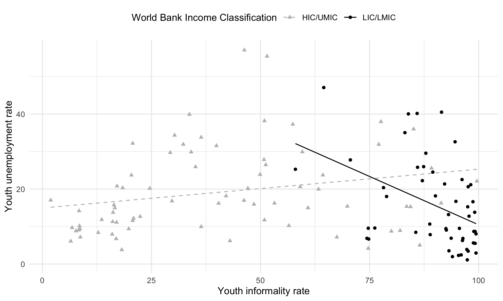

```{r setup, include=FALSE}
knitr::opts_chunk$set(message=FALSE,
                      warning=FALSE,
                      echo = FALSE,
                      cache = TRUE,
                      fig.path='figures/',
                      out.extra = "",
                      floatfoot.envs = c("figure", "table", "longtabu")) 

options(scipen=2, digits=2)
```

```{r loadlibraries, include=FALSE, cache = FALSE}
suppressMessages(library(stargazer))
library(bookdown)
library(gtsummary)
suppressMessages(library(tidyverse))

```

```{r loaddata, include=FALSE}
# rerun all code periodically
# source("../code/master.R")
#load("../data/df.rda")
#selected <- df %>% filter(SELECTED == 1)
# load functions
source("../functions/add_by_n.R")
ggplot2::theme_set(ggplot2::theme_bw())  ## (sets the ggplot2 theme to theme_bw)
```

# Introduction

\noindent Over the past three decades, the global share of youth residing in developing countries has increased by 20 percentage points, to a little over 50 percent of all youth in 2020 [@unitednationsdevelopmentprogramme2019]. This share is expected to continue to rise, and with it the number of young workers entering the workforce [@roser2019]. Lacking formal employment opportunities and facing unemployment without social security, youth in many low-income countries (LICs, as classified by the @worldbank2020a) and lower-middle income countries (LMICs) must resort to work that is irregular, underpaid, and lacking in benefits or advancement opportunities. Few can afford to be inactive for extended periods of job search after leaving school. In sub-Saharan Africa (SSA), where 40 percent of inhabitants are under the age of 15 and where youth population growth is outpacing formal job creation by a large margin, the "youth employment crisis" is increasingly also being seen as a "missing jobs" crisis [@sumberg2021]. Long unemployment spells reduce productive capacity in later life, curtailing youths' earnings potential and dampening the growth prospects of the economy [@gregg2005]. In the worst case, persistent difficulties in transitioning to gainful work can drive youth to political unrest and violence, as has been the case in the Middle East [@urdal2006].

The UN has addressed this issue with its 8th Sustainable Development Goal (SDG)---full and productive employment and decent work for all, with particular emphasis on youth (and other vulnerable populations). Unfortunately, the productivity and decency of work does not lend itself to easy measurement. The unemployment rate is the most widely-used indicator for evaluating labor market strength, but it is largely uninformative in many developing countries, where low savings rates and the lack of social insurance force youth to accept underpaid, unskilled work. In such an environment, rather than indicating widespread "decent" work, low unemployment rates reflect that large segments of the youth population simply cannot afford _not_ to work [@zimmermann2013; @dewan2007]. Thus, to better analyze and compare youth labor markets in developing countries, a more multifaceted indicator than the unemployment rate is needed. 

To this end, this paper presents the Youth Labor Index for Lower-Income Countries (YLILI)---a composite index of 10 youth labor market indicators specifically tailored to the realities of work in low- and lower-middle income countries and organized around three central themes: youth transition to work, working conditions for youth, and human capital. The YLILI builds on a related index compiled by the Swiss Economic Institute (KOF), but relies on indicators that are more relevant to and available for low-income countries. Specifically, the unemployment rate is replaced by indicators more appropriate for the measurement of highly informal economies.

A measure of youth labor market strength will ideally be youth-specific rather than pertaining to the working-age population as a whole. Youth and adults face qualitatively different conditions and obstacles on the labor market. For one, youth often experience worse outcomes than adults: according to the latest ILO statistics for LICs and LMICs, for instance, they were 20 percent (3.2 percentage points) more likely to be among the working poor and 13 percent more likely to be underemployed [@ilo2020b]. Rapid demographic and structural change also imply generational differences in the nature of work: youth face stiffer competition due to growing populations, are more likely to migrate to urban areas [@debrauw2014], and are increasingly eschewing the agricultural work of their parents and grandparents [@honorati2016]. All indicators used in the YLILI are thus disaggregated by age group, covering youth aged 15--24 specifically, and include youth-specific measures such as school test performance. Disaggregation by gender allows for further analysis. Current data availability allows us to generate an overall YLILI score for 54 (out of 79) low- and lower-middle income countries. An accompanying online tool ([https://nadel.shinyapps.io/ylili/](https://nadel.shinyapps.io/ylili/)) allows users to view each index component in detail and compile the ranking according to custom parameters.

The YLILI suggests that, among low-income and lower-middle income countries, youth labor markets perform best in Europe and Central Asia. Meanwhile, 18 of the 20 worst-performing countries are located in SSA (Pakistan and Afghanistan being the two exceptions). The poor performance in SSA is driven primarily by high working poverty rates and low scores on measures of education. In general, education outcomes are found to vary the most across countries, and as such are the main driver of the final index rankings. Perhaps our most striking finding is that demographic patterns best predict the YLILI scores: countries with large youth populations and high fertility rates tend to perform worse on the YLILI index, particularly in the transition and education dimensions. This suggests a compounding of unfavorable demographic and labor market conditions for youth, with the highest numbers of youth entering labor markets with scarce opportunities. Thus, we conclude that prospects for youth in the poorest countries are unlikely to improve until fertility and dependency rates fall substantially. Finally, we examine differences in YLILI scores for young men and women and find that high female inactivity rates and substantial education deficits drive the observed gender gap, particularly in countries that perform poorly on the YLILI overall.

The remainder of the paper is structured as follows. Section \@ref(indicators) describes the indicators of the YLILI and the data. Section \@ref(methods) describes how the indicators are combined to generate the YLILI country score. Section \@ref(results) presents some applications of the YLILI, including regional analysis and a breakdown by gender. Section \@ref(robustness) presents several robustness checks, and highlights potential limitations. Section \@ref(discussion) concludes and discusses some policy implications.

# The YLILI Indicators {#indicators}

\noindent Composite indices help make complex and multidimensional phenomena more tractable by combining multiple measures into country-specific _ranks_ or _progress indicators_, which in turn allow for easier comparisons across countries and over time. Thanks to their simplicity, they are often instrumental in rallying attention to an issue in policy or governance, such as corruption (the Corruption Perceptions Index), human well-being (Human Development Index, HDI) or the business environment (Ease of Doing Business Index). In some cases, indices are also used to bring attention to the misuse of a popular indicator in public discourse. In the case of the HDI, a combination of life expectancy, education and income indicators was proposed as an alternative to GDP as a measure of a country's level of development [@undp1990].

The YLILI is inspired by the Youth Labor Market Index (YLMI), a composite index introduced in 2014 by the Swiss Economic Institute (KOF) and updated annually every year since [@renold2014]. The YLMI is composed of 12 indicators and has helped highlight issues such as the _youth paradox_---unprecedented educational attainment going hand-in-hand with rising youth unemployment in many high-income countries. However, the YLMI's heavy sourcing of data from the EU and OECD means its usefulness is limited to the study of youth labor markets in high-income countries [@pusterla2015; @pusterla2016]. Crucially, the index relies heavily on the unemployment rate, a widely-cited indicator that is much more informative in high-income than low-income contexts. Unemployment rates in the poorest countries regularly fall under 5 percent, but rather than indicating well-functioning labor markets, they remain low because social security systems are weak and informal, and most people simply cannot afford to remain idle [@filmer2014]. Families with low savings are unable to support graduates through an extended job search, leaving young people with no choice but to enter own-account employment or poorly-paid jobs below their skill level [@fields2012, margolis2014], predominantly in the informal sector [@herrera2013; @sengenberger2011].

Economic development tends to go hand in hand with the formalization of work [@laporta2014]---about 90 percent of employed youth in developing countries work in the informal sector on average, compared to less than 20 percent in high-income countries [@bonnet2018]. Formal work comes with many benefits, from higher wages to employment stability and social security coverage. Thus, the fact that among LICs and LMICs, _lower_ unemployment rates tend to be associated with _higher_ rates of informal work---in contrast to rich countries---presents a problem for the unemployment rate as a measure of economic health (Figure \@ref(fig:inf_unemp). An indicator that can mean opposite things depending on development level violates a key assumption of composite indices, namely that each of the constituent indicators provides a well-ordered ranking of performance. For this reason, we exclude the unemployment rate from the YLILI.

{#fig:inf_unemp}

In addition to the unemployment rate, the relaxed unemployment rate (the share of unemployed and discouraged workers relative to the size of the labor force), the relative unemployment rate (ratio of youth to adult unemployed) and the long-term unemployment rate (share of unemployed who have been continuously unemployed for a year or more) are all included in the KOF YLMI and pertain directly to the unemployment rate. We exclude these indicators from the YLILI as well, and replace them with measures that are more relevant for describing labor market conditions in low-income economies. For instance, the working poverty rate (living on less than \$1.90 a day) and the literacy rate are generally close to zero for high-income countries (and thus not part of the YLMI), but vary meaningfully for low-income countries. Table \@ref(tab:kofcomp) in the online Appendix provides a more detailed overview of the similarities and differences between the YLMI and YLILI. 

We stipulate four conditions that an indicator must fulfill to be included in the YLILI. First, the indicator must be a monotonic increasing function of labor market performance. This means that it must be clear whether a higher value of an indicator is always preferred to a lower one (i.e., the higher, the better) or vice-versa. From the perspective of a policy-maker, it must be possible to rank the indicator from the worst to the best outcome. Second, the indicator must be disaggregated by different age groups, and specifically must be available for the 15 to 24 age group. Third, the indicator must be desegregated by sex. Fourth, indicator estimates must be available for at least half of the LMICs and LICs dating back no further than 2010. We limit ourselves to indicators from four reputable compilers of international statistics: ILOSTAT, UNESCO, the World Bank, and the Demographic and Health Surveys (DHS). We retain indicators for which data is available for at least one year since 2010 for 40 or more low-income and lower-middle income countries (as of April 1st 2021, there were 79 LMICs and LICs combined according to the  @worldbank2020a).

Ultimately, we identified ten indicators that meet these conditions. We classified these into three broad dimensions that best reflect, in our view, youth labor markets in developing countries: transition from education to the labor market, working conditions, and educational background (Table \@ref(tab:indicators)). On the demand side, the transition dimension reflects economic participation and the smoothness of the transition from education to the workplace, whereas the working conditions dimension captures the quality of work. The final dimension (education) focuses on the supply side of the labor market, i.e., the skill level of job seekers. Ultimately, indicators were chosen as much based on data availability as desirability; nevertheless, it is worth noting that as with any composite index, the final choice and weighting of indicators is a value-laden interpretation of the authors. A corresponding webtool ([https://nadel.shinyapps.io/ylili/](https://nadel.shinyapps.io/ylili/)) allows users to fine-tune the index to their preference and to test the robustness of the final rankings presented here. For more details on the availability of each indicator, see Section \@ref(availability) in the online Appendix.

\input{tables/indicators.tex}

## Transition from Education to the Labor Market

\noindent The transition category captures quantity adjustments of youth labor in developing countries. The share of youth Neither in Employment nor in Education or Training (NEET) captures the level of inactivity in the youth population, while the youth skills mismatch characterizes the degree to which the supply of youth skills meets employer demand. The relative working conditions ratio is an adaptation of the relative unemployment ratio, and compares labor market outcomes of youth to those of older workers without relying on unemployment rates.

The __share of youth NEET__ captures the percentage of people aged between 15 and 24 years old who are neither in employment nor in education and training (data obtained from ILOSTAT). Hence, it refers to individuals fulfilling two mutually inclusive conditions: (i) they are not employed (i.e., are unemployed, discouraged, or inactive), and (ii) have not received any education or training in the four weeks preceding the survey [@elder2015a]. Young people in education include those attending full-time or part-time education, but exclude those in non-formal education and in educational activities of very short duration [@oecd2019a]. Both formally and informally employed youth are considered to be working, and are thus not counted among NEET youth. Average NEET rates are given in Table \@ref(tab:indicators) and shown graphically in Figure \@ref(fig:transitionmap) in the online Appendix. The NEET rate does not track national income in a linear manner: about 28 percent of youth in lower-middle income countries are NEET, while this rate is closer to 20 percent in both upper-middle and low income countries. High income countries have much lower youth inactivity rates, with just 11 percent youth NEET on average.

The __relative working conditions ratio__ pertains to the difference in two aspects of work quality between youth and adults (aged 25+ years old): the working poverty rate and the time-related underemployment rate. The working poverty rate is expressed as the percentage of workers living below US\$1.90 PPP. The time-related underemployment rate captures the proportion of working youth who are able and willing to increase their working hours and who are working under a threshold number of hours for a reference period. This threshold is determined separately by each country based on national circumstances.

The relative working conditions ratio indicator measures the degree to which working conditions differ for youth and adult workers, and thus captures whether youth enjoy labor conditions that are "typical" for their country. Youth suffering from substantially lower working conditions than the adult working population would suggest that youth engage in different jobs or tasks than adults and indicate a slower transition to decent work. We self-compute it using data from ILOSTAT as follows: 

\footnotesize
$$ \text{Relative WC ratio}= \frac{\displaystyle{\frac{\text{Youth work. poverty rate}}{\text{Adult work. poverty rate (25+)}}} + \displaystyle{\frac{\text{Youth time-related unmp. rate}}{\text{Adult time-related unmp. rate (25+)}}}}{2} $$
\normalsize

\noindent The closer the youth and adult rates, the more the ratio tends to one, suggesting equality in working conditions between youths and adults. Taken separately, the two components of this indicator (working poverty and the underemployment rates) tend to unity in the ideal case: when youth and adult conditions are similar. Jointly, the indicator needs to be interpreted cautiously, as a ratio above one (favoring adults) can be counterbalanced by a ratio below one (favoring youth), creating the impression of equality between generations where there is none. Youth in developing countries are about 20 percent more likely to belong to the working poor than adults, and about 13 percent more likely to face time-related underemployment. Working poverty and underemployment are higher in LICs and LMICs than higher income countries, while the differences (ratios) between youth and adult outcomes tend to be lower in relative terms.

__Job mismatch__ is the third and final indicator in the transition dimension and refers to the difference between a worker's skill level and the level required by their employer. It accounts for two situations: (i) workers who are constrained to accept jobs for which they are overqualified or that do not match their skills/training and (ii) workers who hold jobs for which they are not qualified. Since the mid-1990s and the advent of the United Nation's Millennium Development Goals at the beginning of the 21st century, grass-roots approaches to solving poverty have mainly focused on improving the supply side of the labor market, i.e., making job-seekers more educated and skilled, and not the demand side, i.e. making new and/or better jobs available [@amsden2010say; @gore2010mdg]. As a result, large numbers of over-qualified workers unable to take full advantage of their skills are common in many LMICs and LICs [@handel2016accounting].

There are several ways to measure mismatch. One is to calculate the difference between the highest level of education attained and the dominant level of education observed for the worker's occupation [@herrera2013]. Unfortunately, such an indicator is not available and cannot be computed using aggregated data. Our solution is to mirror the skills mismatch indicator used in the KOF YLMI, which utilizes the unemployment rate at different levels of education. This indicator captures the extent to which workers with a certain level of education are more or less affected by unemployment than others. Because this indicator is unavailable as such, we compute it manually using unemployment data disaggregated by age and level of education from ILOSTAT as follows: 

\footnotesize
$$\text{Skills mismatch rate}= \frac{1}{2} \sum_{k=1}^4 \Bigl| \Bigl(\frac{\text{Youth emp. with edu.} \ k}{\text{Total youth emp.}}- \frac{\text{Youth unemp. with edu.} \ k}{\text{Total youth unemp.}}\Bigl)\Bigl|$$
\normalsize

\noindent where $k$ is the highest level of education completed (less than basic; basic; intermediate; advanced) and thus the higher the mismatch, the higher the rate. One shortcoming is that, since workers often have no choice but to take any job available, educational attainment can become undervalued in a saturated labor market. As a result, unemployment becomes less contingent on one's level of education, and can lead to an underestimated measurement of skill mismatch. With this caveat in mind, the youth skills mismatch rate averages just 12\% globally (Table \@ref(tab:indicators) and Figure \@ref(fig:workcondmap) in the online Appendix) and rarely exceeds 20\% in developing countries using this definition.

## Working Conditions

\noindent The working conditions category aims to measure the quality and decency of employment, as promoted by SDG \# 8: full and productive employment and decent work for all. We attempt to capture whether the jobs performed by youth are sufficient to keep them out of abject poverty and generate a safe and stable livelihood. We rely on four indicators of working conditions: the proportion of youth working in poverty, the youth time-related underemployment rate, the share of youth in informal employment, and the share of youth working in elementary occupations. The vulnerable employment rate is also available for LICS and LMICs, but is conceptually similar to the informality rate, leading to concerns of double-counting youth and skewing the index. Moreover, it correlates closely with a number of other indicators in the index, including the informality rate, suggesting that little information is lost when we exclude it.

The __youth working poverty rate__ measures the proportion of youth working below the international poverty line set at \$1.90 PPP a day, i.e., measures the proportion of working youths living in "extreme" poverty (data obtained from ILOSTAT). The first shortcoming of this indicator is that it is estimated from household surveys and thus fails to account for intra-household distribution of resources; we have to assume that resources are equally distributed between members of the household. A second concern is that it splits the population into poor and non-poor, implying a substantial change in living conditions at the cutoff and neglecting important features of the income distribution (e.g., the distance of the poorest youth from the \$1.90 line). Finally, since raw data for this indicator is not currently available, we rely instead on modelled estimates generated by the ILO for country-year pairs for which country-reported data is unavailable. Thus, measurement error may bias this particular indicator. We are also aware that because this indicator is based on the monetary value of a person's consumption expenditures or income, it remains silent about other dimensions of poverty [@poverty2013measuring]. Multidimensional measures of poverty, such as the Multidimensional Poverty Index [@alkire2011counting] aim to address this shortcoming, though aggregate data on youth working in multidimensional poverty is currently unavailable and, in most cases, income poverty is highly correlated with measured multidimensional poverty for the adult population. According to the most recent estimates from the ILO, about 12 percent of working youth globally live in extreme poverty, though they are unsurprisingly concentrated in low-income settings: 39 percent of Africa's working youth and 41.7 percent of working youth in low-income countries live below \$1.90 a day. Wide variations exist between countries, as shown in Figure \@ref(fig:workcondmap) in the online Appendix.

The __youth time-related underemployment rate__ measures the share of youths employed who (i) are willing to work additional hours, (ii) are available to work additional hours, and (iii) worked less than a specified time threshold (combining all jobs), thus capturing the share of working youth whose productive capacity is underutilized (data obtained from ILOSTAT). The average youth-time related underemployment rate across all developing countries is about 10 percent (see Table \@ref(tab:indicators) and Figure \@ref(fig:workcondmap) in the online Appendix).

The __share of youth in informal employment__ is the third indicator in the working conditions dimensions and is measured as a proportion of all working youth. According to the ILO, whether a job is categorized as informal depends on the status in employment of the worker. For own-account workers and employers, the formality of employment is determined by the formal or informal nature of their enterprise. For the employed, the formality of employment is defined by the employment relationship of employees to their employer: informal work is not subject to national labor legislation or income taxation or entitled to social protection or certain employment benefits, in law or in practice (data retrieved from @Bonnet2018ILO). Youth aged 15--24 are subject to the highest rates of informal work in every region of the world except Europe and Central Asia [@Bonnet2018ILO]. About 96 percent of working youth in SSA and Southern Asia work in informal jobs, per the @ilo2020. Even in Latin America, where the rate of formal wage employment is growing faster than the size of the working population, 55 percent of employed youth still work in the informal sector, leaving them particularly vulnerable to the frequent economic crises that continue to buffer the continent [@ilo2015]. As informality is associated with wage instability and precarious working conditions, this indicator is a vivid expression of the youth employment problem in developing countries.

Finally, the __share of youth working in elementary occupations__ is based on the definition of the ILO's International Standard Classification of Occupations 2008 (ISCO-08). Elementary occupations include cleaners and helpers, agricultural, forestry and fishery laborers, laborers in mining, construction, manufacturing and transport, food preparation assistants, street and related sales and services workers, refuse workers. These jobs usually involve low-skilled, physical tasks which may entail high risk of injury. We self-compute this indicator by obtaining employment data disaggregated by age and occupation from ILOSTAT. About 1 out of 5 workers is employed in an elementary occupation across developing countries (Table \@ref(tab:indicators) and Figure \@ref(fig:workcondmap) in the online Appendix).

## Education

\noindent This final dimension focuses on the supply side of the labor market, i.e., education and skills acquired by job seekers. The skills required by employers depend greatly on the structural composition and stage of development of the economy in question. To ensure comparability for a global index, we thus focus on the most fundamental skills required for gainful employment: basic literacy and the duration and quality of education.  To measure the quantity of education, we employ the proportion of youth with no secondary education. To capture if youths have acquired the most basic skills relevant for employment, we use the youth illiteracy rate and a novel set of harmonized test scores.

We self-compute the __share of youth without secondary education__ using data from the Demographic and Health Surveys (DHS) Program. The DHS data classifies individuals according to their highest attained level of education in one of the following 6 categories: (i) no education, (ii) some primary education, (iii) completed primary education, (iv) some secondary education, (v) completed secondary education, (vi) more than secondary education. We define no secondary education as the sum of the first 3 categories (share with no education, share with some primary education, and share with completed primary education). For simplicity, we assume that the share of female and male youth in every country is equal at any time $t$: the sex ratio of youth aged 15-24 is close to 1 for nearly all developing countries [@central2016world]. We drop observations for which only female or only male data is available. Despite widespread efforts to increase school enrollment over the past three decades, about 45 percent of youth have still never pursued any secondary education (Table \@ref(tab:indicators)). Figure \@ref(fig:educationmap) in the online Appendix reveals that this is still a considerable issue in SSA, where more than 60 percent of young people have never attended a single year of secondary education (e.g., Ethiopia, Mali, Malawi, etc.).

The __youth illiteracy rate__ measures the percentage of youth who are declared illiterate. It gives the most simple and straightforward indication on the overall minimum level of measurable skills attained by job seekers (data obtained from UNESCO). About one out of every five youths in developing countries is illiterate. Figure \@ref(fig:educationmap) in the online Appendix indicates that youth illiteracy rates are low globally, and that only a handful of countries still have rates above 40\% (mainly located in Western Africa).

Finally, we include a set of __harmonized test scores__ recently compiled by the World Bank to measure the quality of primary and secondary education. For decades, the literature exploring the impact of education on economic development has used years of schooling as a measure of human capital [e.g. @barro1991economic; @mankiw1992contribution, among others]. Using years of schooling as a proxy for human capital can be problematic, however, in that it assumes that school enrollment or attendance automatically translates into learning. This is often not the case, particularly in low-income countries [@mundial2018world]. To address this shortcoming, we exploit so-called _harmonized test scores_, one of the 3 components of the World Bank's new human capital index [@angrist2019measuring; @kraay2018methodology]. Harmonized test scores are computed from major international literacy and numeracy testing programs at the primary and secondary education levels. Evidence suggests that individuals with such basic skills have a higher likelihood of success in the labor market and that their skill remains highly valued worldwide [@vignoles2016economic]. Harmonized test scores are measured on the TIMMS (Trends in International Maths and Science Study) scale, where 300 is lowest possible score and 625 is the highest. Harmonized test scores are low in developing countries, With a mean of 380 compared to 452 in HICs/UMICs. Figure \@ref(fig:educationmap) in the online Appendix shows that harmonized test scores are particularly low in SSA, where only four countries---Kenya, Gabon, Seychelles, Mauritius---outperform the HIC/UMIC mean.

# Index Construction {#methods}

\noindent The basic paradigm for composite indices is to rescale indicators to ensure comparability before grouping them into "dimensions", which are then used for final aggregation. The YLILI is scaled to vary between 0 (dysfunctional labor market) and 100 (well-functioning labor market). The YLILI keeps rescaling to a minimum to ensure ease of interpretation. Eight out of the 10 indicators used are already rates, allowing us to retain raw scores without any normalization. For the two indicators that are not rates---the relative working conditions ratio and the harmonized test scores---the Min-Max normalization method is used, in line with several well-known composite indices such as the Human Development Index or the Global Competitiveness Index 4.0 [@decancq2013; @joint2008handbook]. The working conditions ratio is given upper and lower bounds of 10 and 1 respectively, while the harmonized test scores are given a higher and lower bound equal to their natural scale of 300 and 625 (see section \@ref(weights) in the Appendix for more details). 

The 10 indicator scores, all on a scale of 0 to 100, are first combined into three dimension scores, which are then likewise combined to produce an aggregate index score. We use the arithmetic mean to calculate the dimension scores as well as the overall YLILI score. In other words, each dimension score is a simple average of its underlying indicators, and the YLILI score is a simple average of the three dimension scores for each country. Formally, this implies that YLILI is computed as follows:

$$ \text{YLILI}_{c}= \sum_{d=1}^{3} \frac{1}{3} \cdot s_{dc}  $$

\noindent where $s_{dc}= \sum_{i=1}^{m_d} s_{idc} \cdot w_{id}$ represents the score of dimension $d$ for country $c$, $w_{id}$ corresponds to the weight attributed to indicator $i$ in dimension $d$ where $\sum w_{id}=1$, and $m_d$ is the total number of indicators in dimension $d$ with score different from zero. We thus assume that, in each dimension, each indicator is of equal importance. In this sense, the YLILI contends that countries need to be holistic in their approach to fostering their youth labor market and that no area---transition, working conditions, or education---should be neglected. A further advantage of attributing equal weights to each dimension is that it sets each country a level playing field to define its path to progress [@wef2018].

Due to the scarcity of observations for low-income countries, we compute the index by using the last available year that was reported for each indicator and country, dating back no later than 2010. Index scores were only computed for countries with a minimum of two non-missing indicators in the transition and education dimensions and three indicators in the working condition dimension (i.e., at least seven out of ten indicators from 2010 or later). For countries missing three or fewer indicators, these missing values are imputed using countries' percentile ranking in the given dimension to prevent them from skewing the index. For more detail on data availability and selection criteria, see section \@ref(availability) in the online Appendix.

Finally, missing values are always an issue when dealing with country-level data in low-income countries. When using arithmetic means, the number of indicators included implicitly determines the weight of each indicator. The more indicators are missing in a dimension, the more weight will be attributed to the available indicator and thus bias the overall comparability between countries, with the direction of this bias depending on the distribution of non-missing values. For this reason, estimated values are often preferred to missing values. There are numerous methods for imputing missing values. The missing data can be taken to be the average of similar units for which data exists (hot deck imputation) or regressed on the indicators in the index [@joint2008handbook; @wef2018]. Missing values for the YLILI are imputed by assuming that countries' relative performance is similar within a given dimension: countries' performance on non-missing indicators are computed first, then their percentile rank in a given dimension is used to impute the missing indicator.

In the end, the choices surrounding the rescaling, aggregation, time span, and imputation of data to arrive at the final YLILI were made in an attempt to maximize the number of countries covered while relying on reliable, up-to-date, and comparable indicators. However, these choices are disputable, and the [webtool](https://nadel.shinyapps.io/ylili/) has been designed expressly to allow users to experiment with the YLILI construction and to arrive at their own conclusions regarding the best aggregation approach.

# Results {#results}

## The YLILI

\noindent The score distribution of each of the three dimensions and 10 constituent indicators are summarized in Table \@ref(tab:descriptives). Overall, transition scores are higher than education or working conditions scores. Youth in LICs and LMICs countries are still quite poorly educated, and appear to transition quickly to jobs with poor working conditions - possibly because they are unable to withstand extended periods of inactivity. Moreover, transition scores are close across all countries of the world ($sd$ = 9.25), while wider variation exists for education (sd = 13.56) and, to a lesser extent, working condition scores ($sd$ = 10.15). Thus, youth working poverty ($sd$ = 23.73), the share of youth without secondary education (sd=17.84) and the youth illiteracy rate ($sd$=17.10) play a large role in determining final rankings of countries. 

\include{tables/lastyear}

Table \ref{tab:ranking} shows the YLILI score for the 54 countries covered by the data, together with each country's overall score, its scores on the three constituent dimensions, its respective ranking (between 1 and 54) for the overall and dimension scores, and the mean dimension rank (for or a visual representation, see Figures \@ref(fig:worldmap) and \@ref(fig:totalmap) in the online Appendix). From the sample of low and lower-middle income countries analyzed, Ukraine scores the highest on the YLILI (84.67) with high scores in all three dimensions (all above 80), followed by Moldova, Mongolia, Kyrgyzstan, Cambodia, and Viet Nam. Niger ranks last (with an overall score of 40.54) and is joined in the bottom five by Madagascar, Mali, Afghanistan, and Rwanda. Of the 20 worst-performing countries, 18 are located in SSA, with Pakistan (34th) and Afghanistan (51st) being the two exceptions.


Figure \@ref(fig:spider) in the online Appendix depicts indicator scores by world region. Aside from the strong overall performance of the two Eastern European countries (Moldova and the Ukraine), visual inspection reveals no substantial differences in YLILI and its indicators across regions. The low number of countries in Eastern Europe (2), Northern Africa (4) and Latin America (4) also require that any regional averages are treated with caution. Across all regions, formality rates and harmonized test scores leave the most room for improvement. 

Comparing absolute levels, SSA scores critically low (nearly 10 points lower than the next-lowest region) on the education dimension (mean= 47.9) and the working conditions dimension (mean= 56.7). The low working conditions scores are driven primarily by working poverty. On the other hand, SSA does not perform worse than the rest of the sample on the transition dimension: youth in SSA are not exposed to significantly more education-based job mismatch, larger generational gaps in working conditions, or higher NEET rates than developing countries from other regions of the world.

\input{tables/ranking}


# References {.unnumbered}
\noindent

<div id="refs"></div>

\appendix
\section{Appendix A}

## Availability {#availability}

## Weights {#weights}

\section{Online Appendix B}

## Availability of indicators
\input{tables/kofcomparison.tex}

## Geographic distribution of YLILI scores

```{r transitionmap, echo=FALSE, fig.align = "center", out.width = '70%', fig.show='hold', fig.cap="Indicators of the transition dimension depicted by country"}
knitr::include_graphics(c("figures/maps/NEET_total.png", "figures/maps/wcratio_total.png", "figures/maps/skillsmismatch_total.png"))
```

```{r workcondmap, echo=FALSE, fig.align = "center", out.width = '52%', fig.show='hold', fig.cap="Indicators of the working conditions dimension depicted by country"}
knitr::include_graphics(c("figures/maps/workingpoverty_total.png", "figures/maps/underemployment_total.png", "figures/maps/informal_total.png", "figures/maps/elementaryoccup_total.png"))
```

```{r educationmap, echo=FALSE, fig.align = "center", out.width = '69%', fig.show='hold', fig.cap="Indicators of the education dimension depicted by country"}
knitr::include_graphics(c("figures/maps/secondaryeduc_total.png", "figures/maps/illiteracy_total.png", "figures/maps/harmonizedtest_total.png"))
```

```{r spider, echo=FALSE, fig.align = "center", out.width = '49%', fig.show='hold', fig.cap="Spider charts by world region"}
options(width = 1500)
knitr::include_graphics(c("figures/Asia_spider.png", "figures/Eastern_Europe_spider.png", "figures/Latin_America_spider.png", "figures/Northern_Africa_spider.png", "figures/Sub-Saharan_Africa_spider.png"))
```

```{r worldmap, echo=FALSE, fig.align = "center", fig.cap = "Total YLILI depicted by country"}
knitr::include_graphics("figures/maps/YLILI_total.png")
```

```{r totalmap, echo=FALSE, fig.align = "center", out.width = '69%', fig.show='hold', fig.cap="Dimensions of the YLILI depicted by country"}
knitr::include_graphics(c("figures/maps/transition_total.png", "figures/maps/working_conditions_total.png", "figures/maps/education_total.png"))
```


